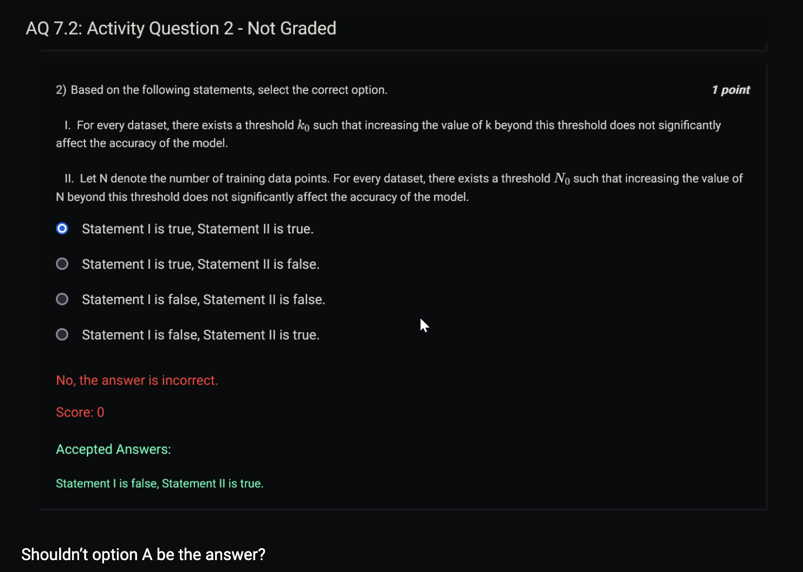
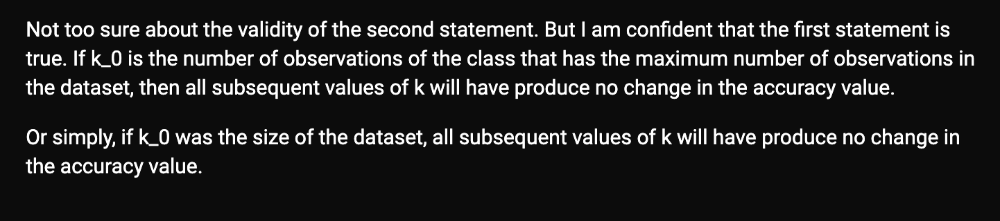

```
from sklearn.feature_extraction.text import CountVectorizer

text_documents = ['Machine learning (ML) is the study of computer algorithms that can improve automatically through experience and by the use of data.']
clf=CountVectorizer()
x=clf.fit_transform(text_documents)
print(text_documents)
print(x.shape)
# to get more understanding of the output, convert it to array
print(x.toarray())
# to get the feature names of the output vector 
print(clf.get_feature_names_out())
```

- ['Machine learning (ML) is the study of computer algorithms that can improve automatically through experience and by the use of data.']
- (1, 19)
- [[1 1 1 1 1 1 1 1 1 1 1 1 1 2 1 1 2 1 1]]
- ['algorithms' 'and' 'automatically' 'by' 'can' 'computer' 'data'
 'experience' 'improve' 'is' 'learning' 'machine' 'ml' 'of' 'study' 'that'
 'the' 'through' 'use']

 - PA 7.2 Q5