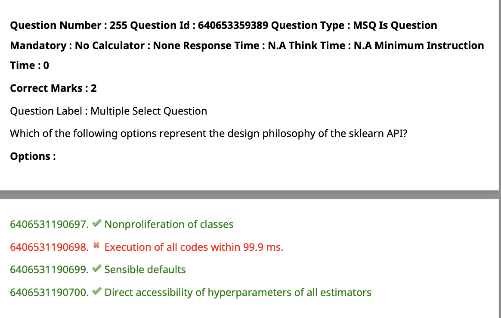
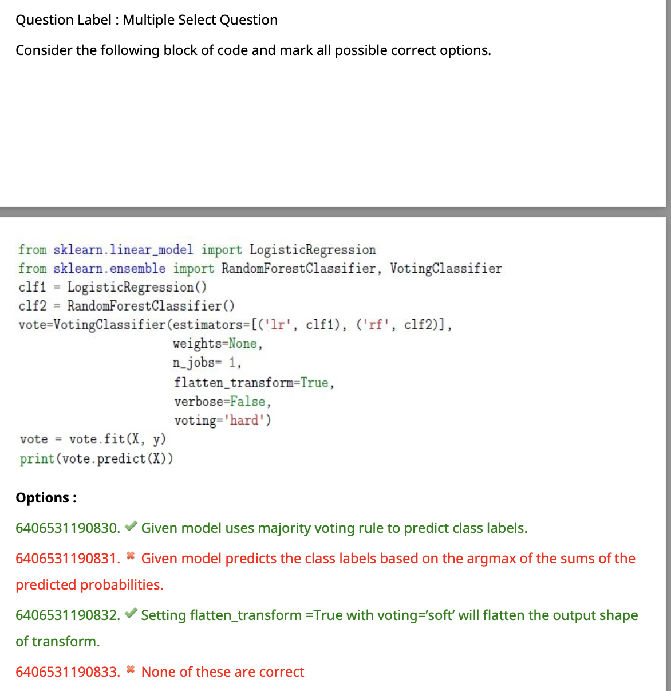

```
from sklearn.datasets import make_classification, make_regression

# Example 1: Generating a synthetic classification dataset
X_classification, y_classification = make_classification(
    n_samples=1000,  # Number of samples
    n_features=20,   # Number of features
    random_state=42  # Random seed for reproducibility
)

# Example 2: Generating a synthetic regression dataset
X_regression, y_regression = make_regression(
    n_samples=1000,  # Number of samples
    n_features=1,    # Number of features
    noise=0.1,       # Amount of noise in the data
    random_state=42  # Random seed for reproducibility
)
# adding noise to the data is important because it makes the data more realistic and prevents the model from learning the data by heart

```

- Loaders vs fetchers
    - Loaders: load data from disk (e.g. `load_boston()`)  and return it as a numpy array
    - Fetchers: download data from the internet (e.g. `fetch_openml()`) and return it as a numpy array
    - `load_boston()` returns a dictionary with the following keys:
        - `data`: the data to learn
        - `target`: the regression target
        - `feature_names`: the meaning of the features
        - `DESCR`: the full description of the dataset
        - `filename`: the physical location of boston csv dataset (added in version 0.20)
    - loaders are for small datasets, fetchers are for large datasets that can't be stored on disk


- 
    - main purpose of Feature Union is to combine several transformers into a single transformer that combines their output
    - `FeatureUnion` takes a list of transformer objects. During fitting, each of these is fit to the data independently. For transforming data, the transformers are applied in parallel, and the sample vectors they output are concatenated end-to-end into larger vectors.
    - `FeatureUnion` serves the same purposes as `Pipeline` - convenience and joint parameter estimation and validation.
    - `FeatureUnion` and `Pipeline` can be combined to create complex models.
    - `FeatureUnion` is useful for combining features extracted from different feature extraction mechanisms, such as vectorizers and transformers based on PCA or feature selection, in a single feature space.
    - https://scikit-learn.org/stable/modules/generated/sklearn.pipeline.FeatureUnion.html#
    ```
    from sklearn.pipeline import Pipeline, FeatureUnion
    from sklearn.preprocessing import StandardScaler, MinMaxScaler
    from sklearn.decomposition import PCA
    from sklearn.datasets import load_iris

    # Load a sample dataset (Iris dataset)
    data = load_iris()
    X = data.data

    # Create transformers
    scaler = StandardScaler()
    minmax_scaler = MinMaxScaler()
    pca = PCA(n_components=2)

    # Create a FeatureUnion
    features_union = FeatureUnion([
        ('scaler', scaler),             # Apply StandardScaler
        ('minmax_scaler', minmax_scaler), # Apply MinMaxScaler
        ('pca', pca)                    # Apply PCA
    ])

    # Create a pipeline with the FeatureUnion
    pipeline = Pipeline([
        ('feature_union', features_union),
        # You can add other steps to the pipeline here, like a classifier or regressor.
    ])

    # Fit and transform the data using the pipeline
    X_transformed = pipeline.fit_transform(X)

    # X_transformed now contains the combined and transformed features

    ```
    
    
    ```
    from sklearn.datasets import make_blobs
    X,y = make_blobs(n_samples=10, n_features=2, centers=3, random_state=0)
    print(X.shape)
    ```
    - the `make_blobs()` function generates a dataset of points that belong to one of three clusters
    - answer is 10,2 because there are 10 points and each point has 2 features

- 

- 
```
import numpy as np
from sklearn.preprocessing import MaxAbsScaler
X=[[1.,-1.,2.],
   [2.,0.,0.],
   [0.,1.,-1.]]
transformer = MaxAbsScaler().fit(X)
transformer.transform(X)
```
- the `MaxAbsScaler` scales each feature by its maximum absolute value. It does not shift/center the data, and thus does not destroy any sparsity.
- `fit()` is used to calculate the maximum absolute value of each feature
- the answer is `[[0.5,-1.,1.],[1.,0.,0.],[0.,1.,-0.5]]` because the maximum absolute value of each feature is `2,1,2` respectively, and 
- each feature is divided by its maximum absolute value

- 
```
from sklearn.preprocessing import StandardScaler
data=[[0,0],[0,0],[1,1],[1,2]]
scaler = StandardScaler()
scaler.fit(data)
print(scaler.mean_)
```
- the `StandardScaler` standardizes features by removing the mean and scaling to unit variance
- `fit()` is used to calculate the mean and standard deviation of each feature
- the answer is `[0.5,0.75]` because the mean of each feature is `0.5,0.75` respectively


```
import numpy as np
x=np.array([[5,4],[3,8],[2,0],[9,6]])
from sklearn.preprocessing import add_dummy_feature
x_new=add_dummy_feature(x)
print(x_new)
```
- the `add_dummy_feature` function adds a feature with constant value equal to `1` to the input array
- the answer is `[[1,5,4],[1,3,8],[1,2,0],[1,9,6]]` because a column of `1`'s is added to the input array


```
from sklearn.preprocessing import MultiLabelBinarizer
mlb=MultiLabelBinarizer()
mlb.fit_transform([(1,2),(3,)])
```
- the `MultiLabelBinarizer` transforms between iterable of iterables and a multilabel format, e.g. a `(samples x classes)` binary matrix indicating the presence of a class label
- the answer is `[[1,1,0],[0,0,1]]` because the first tuple has `1` and `2` as its elements, and the second tuple has `3` as its element
- 

```
import numpy as np
from sklearn.decomposition import PCA
X=np.array([[1,1],[2.2]])
pca=PCA(n_components=2)
pca.fit(X)
print(pca.explained_variance_ratio_)
```
- the `PCA` class performs principal component analysis (PCA)
- `fit()` is used to fit the model with X
- the answer is [1,0] because the first principal component explains 100% of the variance in the data, and the second principal component explains 0% of the variance in the data


- 
```
import numpy as np

X=[1,2,3,4]
loo=LeaveOneOut()
split=1
for train,test in loo.split(X):
    print("TRAIN:",split,train,"TEST:",test)
    split+=1
```
- the `LeaveOneOut` class is a cross-validator that splits the data into training and test sets. For each training set, it leaves one observation out, and uses that observation as the test set
- the answer is 
    - `TRAIN: 1 [1 2 3] TEST: [0] `
    - `TRAIN: 2 [0 2 3] TEST: [1] `
    - `TRAIN: 3 [0 1 3] TEST: [2] `
    - `TRAIN: 4 [0 1 2] TEST: [3]` 
    - the above numbers are indices of the elements in the original array `X`
    - this is a leave-one-out cross-validation,
    - because the first training set is `[1,2,3]` and the first test set is `[0]`, the second training set is `[0,2,3]` and the second test set is `[1]`, the third training set is `[0,1,3]` and the third test set is `[2]`, and the fourth training set is `[0,1,2]` and the fourth test set is `[3]`


- option 1 is correct
- option 2 3 wrong import statements


```
import numpy as np
from sklearn.linear_model import LinearRegression
X=np.array([[0,0],[1,1],[2,2],[3,3]])
y=np.dot(X,np.array([1,1]))-1
# here y will be [0,1,3,5]
reg=LinearRegression().fit(X,y)
print(reg.predict(np.array([[5,6]])))
```
- the answer is `[10.]` because the linear regression model is `y=2x-1`, and `x=[5,6]` so `y=2*5-1=9`
- 
```
from sklearn.preprocessing import PolynomialFeatures
poly_transform=PolynomialFeatures(degree=2,interaction_only=True)
```
- the `PolynomialFeatures` class generates polynomial and interaction features, and is used to generate a new feature matrix consisting of all polynomial combinations of the features with degree less than or equal to the specified degree
- the answer is `1,x1,x2,x1x2` because `interaction_only=True` means that only interaction features are generated, and `degree=2` means that the maximum degree of the polynomial features is 2
- it will also generate `x1^2` and `x2^2` but these are not in the answer because they are not interaction features
- one more column 1 is added to the answer because `include_bias=True` by default

- 
```
from sklearn.datasets import load_digits
from sklearn.linear_model import Perceptron
X,y=load_digits(return_X_y=True)
clf=Perceptron(tol=1e-3,random_state=0)
clf.fit(X,y)
print(clf.score(X,y))
```
- score will be in the range `[0,1]`
- the answer is `0.9393433500278241` because the perceptron model is trained on the entire dataset, and the score is the mean accuracy on the given test data and labels
- 
```
from sklearn.linear_model import LogisticRegression
logreg=LogisticRegression()
logreg.fit(X,y)
```
- the `LogisticRegression` class implements regularized logistic regression using the `liblinear` library, `newton-cg`, `sag`, `saga` and `lbfgs` solvers
- it will do binary classification by default

```
y_true = [0, 1, 2, 2, 2]
y_pred = [0, 0, 2, 2, 1]
print(recall_score(y_true, y_pred))
```
- recall = TP/(TP+FN)
- the question is asking for the recall of class 2
- the answer is `0.6666666666666666` because there are 2 true positives and 1 false negative for class 2, so the recall is 2/(3)=0.6666666666666666
- here false negative means that the model predicted the class to be something else, but the actual class was 2

- 
```
from sklearn.cluster import KMeans
import numpy as np
X=np.array([[2,4],[4,2],[8,10],[10,12],[20,21],[17,19]])
kmeans=KMeans(n_clusters=3,random_state=5).fit(X)
print(kmeans.labels_)
```
- the `KMeans` class performs k-means clustering
- option 1 is incorrect only 2 classes
- option 2 is correct
- option 3 , try plotting the points, the answer is incorrect
- option 4 is incorrect, because only 2 classes


```
from sklearn.datasets import load_iris
X,y=load_iris(return_X_y=True,as_frame=True)
from sklearn.neural_network import MLPClassifier
rs=MLPClassifier(activation='logistic',random_state=12).fit(X,y)
print(rs.out_activation_)
```
- the `MLPClassifier` class implements a multi-layer perceptron (MLP) algorithm that trains using Backpropagation
- the answer is `softmax` because the `logistic` activation function is used for binary classification, and the `softmax` activation function is used for multi-class classification
- logistic function is `1/(1+e^-x)`
- softmax function is `e^x/(e^x+e^x+e^x+...)`
- here we have 3 classes, so the softmax function will be `e^x/(e^x+e^x+e^x)`
- if we had 2 classes, the softmax function would be `e^x/(e^x+e^x)` which is the same as the logistic function 
- since the logistic function is used for binary classification, the softmax function is used for multi-class classification
- even after giving logistic as the activation function, the answer is softmax because the `out_activation_` attribute is used to store the name of the output activation function for the hidden layer and not the input layer (which is logistic). The output layer is softmax because we have 3 classes




- ridge regression is used to prevent overfitting
- ridge regression is used when there is multicollinearity in the data (when the features are highly correlated with each other) , because it reduces the coefficients of the features that are highly correlated with each other to prevent overfitting 
- The RidgeCV estimator in scikit-learn is specifically designed for ridge regression with cross-validation to find the best regularization parameter (alpha). You can use it to search for the optimal alpha value using cross-validation.


```
from sklearn.linear_model import LogisticRegression
from sklearn.ensemble import RandomForestClassifier, VotingClassifier
clf1=LogisticRegression()
clf2=RandomForestClassifier()
vote=VotingClassifier(estimators=[('lr',clf1),('rf',clf2)],weights=None,n_jobs=1,flatten_transform=True,verbose=False,voting='hard')

```
- given model uses majority voting rule to predict the class labels
- the answer is `voting='hard'` because the `voting` parameter is used to specify the type of voting rule to use for predictions (hard or soft)
- `hard` means that the predicted class label for a particular sample is the class label that represents the majority of the predictions generated by the classifiers in the ensemble for that sample
- `soft` means that the predicted class label for a particular sample is the class label that represents the highest weighted average of the predicted probability of that sample by the classifiers in the ensemble for that sample


```
from sklearn.preprocessing import PolynomialFeatures
import numpy as np
X=np.arange(6).reshape(3,2)
# X is [[0,1],[2,3],[4,5]]
poly=PolynomialFeatures(degree=2)
# degree=2 means that the maximum degree of the polynomial features is 2
# the features after applying polynomial features will be [1,x1,x2,x1^2,x1x2,x2^2]
print(poly.fit_transform(X))
```
- the answer is `[[1,0,1,0,0,1],[1,2,3,4,6,9],[1,4,5,16,20,25]]` because the `PolynomialFeatures` class generates polynomial and interaction features, and is used to generate a new feature matrix consisting of all polynomial combinations of the features with degree less than or equal to the specified degree
- 

```
from sklearn.metrics import confusion_matrix
y_true=['cat','ant','cat','cat','ant']
y_pred=['ant','ant','cat','cat','ant']
print(confusion_matrix(y_true,y_pred,labels=['ant','cat']))
# to display confusion matrix in a more readable format
import pandas as pd
pd.crosstab(pd.Series(y_true,name='Actual'),pd.Series(y_pred,name='Predicted'))

```
- the answer is `[[2,0],[1,2]]` because the confusion matrix is a matrix that is used to evaluate the performance of a classification model
- here the ants are the positive class and the cats are the negative class
- the confusion matrix is a 2x2 matrix, where the rows represent the actual class labels and the columns represent the predicted class labels


- The given figure is a line graph with two axes, TPR on the y-axis and FPR on the x-axis. The line is a straight line from the bottom left corner to the top right corner. This graph represents the ROC curve of a classifier. The ROC curve is a plot of the true positive rate (TPR) against the false positive rate (FPR) at different classification thresholds.
- The ROC curve is a useful tool for a few reasons:
    - The curves of different models can be compared directly in general or for different thresholds.
    - The area under the curve (AUC) can be used as a summary of the model skill.
    - The shape of the curve contains a lot of information about the test, and we may need to summarize the information for use in other contexts.
- 
```
import numpy as np
from sklearn.dummy import DummyRegressor
X=np.array([1.0,1.5,2.0])
y=np.array([1,2,3])
dum_re=DummyRegressor(strategy='mean')
dum_re.fit(X,y)
print(dum_re.predict(x))
```
- the `DummyRegressor` class is a regressor that makes predictions using simple rules
- the answer is `[2.]` because the `strategy` parameter is used to specify the prediction strategy
- `mean` means that the prediction is the mean of the training targets(y_mean will be the prediction)