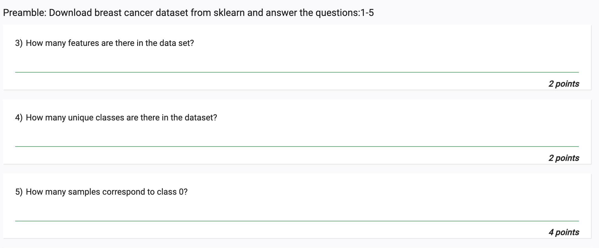

3)
```
from sklearn.datasets import load_breast_cancer

cancer = load_breast_cancer()
# How many features are there in the data set?
print(len(cancer.feature_names))
```
- Ans : 30

4)
```
from sklearn.datasets import load_breast_cancer

cancer = load_breast_cancer()
# How many unique classes are there in the dataset?
print((len(cancer.target_names)))
```
- Ans: 2
5)
```
from sklearn.datasets import load_breast_cancer

cancer = load_breast_cancer()
# How many samples correspond to class 0?
x=cancer.target[cancer.target == 0].shape[0]
print(x)
```
Ans : 212

6)
```
from sklearn.datasets import load_breast_cancer

X,y = load_breast_cancer(as_frame=True,return_X_y=True)
# Is there any categorical feature?
# we need to have it as pandas dataframe to use info()
print(X.info())
```
- Ans : No

7)
```
from sklearn.datasets import load_breast_cancer

X,y = load_breast_cancer(as_frame=True,return_X_y=True)

# What is the pearson correlation between the features 'mean perimeter' and 'mean radius'?
# Round your answer to 3 decimal places.
# Hint: Use the pandas.DataFrame.corr() method.

print(X.corr().loc['mean perimeter','mean radius'].round(3))
```
- Ans : 0.998

8)
```
# Import SimpleImputer from SkLearn library.
# # Take a matrix [[7, 16, 31], [np.nan, np.nan, 66], [12, 5, np.nan],[98, np.nan, 92]].
# #  Impute the missing values in the matrix using SimpleImputer with Mean What is the imputed matrix using fit_transform?

import numpy as np
from sklearn.impute import SimpleImputer

matrix = np.array([[7, 16, 31], [np.nan, np.nan, 66], [12, 5, np.nan],[98, np.nan, 92]])
# print(matrix)

imp = SimpleImputer(missing_values=np.nan, strategy='mean')
imp.fit(matrix)
matrix = imp.transform(matrix)
print(matrix)
```
- Ans : [[ 7. 16. 31. ] [39. 10.5 66. ] [12. 5. 63. ] [98. 10.5 92. ]]


9)
```

# Import FunctionTransformer from the SkLearn library.
# Apply log base 10 to the elements of the following array : [[1, 1], [2, 3],[10,100]] .
# What is the resultant matrix?

from sklearn.preprocessing import FunctionTransformer
import numpy as np

arr = np.array([[1, 1], [2, 3],[10,100]])
# print(arr)

transformer = FunctionTransformer(np.log10)
print(transformer.transform(arr))
```
- Ans : [[0. 0. ] [0.30103 0.47712125] [1. 2. ]]

10)
```
# Read the CSV file from https://archive.ics.uci.edu/ml/machine-learning-databases/iris/iris.data, define the column headers as `'sepal length', 'sepal width', 'petal length', 'petal width','label'.

#     Generate a new feature matrix consisting of all polynomial combinations of the features with degree 2 (For example, if an input sample is two dimensional and of the form [a,b] , the degree-2 polynomial features are
#                                                                                                            What are the shapes of the feature matrix before and after the polynomial transformation?

# What are the shapes of the feature matrix before and after the polynomial transformation?


import pandas as pd
import numpy as np
from sklearn.preprocessing import PolynomialFeatures

df = pd.read_csv('https://archive.ics.uci.edu/ml/machine-learning-databases/iris/iris.data', header=None)
df.columns = ['sepal length', 'sepal width', 'petal length', 'petal width','label']
print(df.shape)
X = df[['sepal length', 'sepal width', 'petal length', 'petal width']]
y = df['label']

poly = PolynomialFeatures(2)
X_poly = poly.fit_transform(X)

print(X_poly.shape)
```
- Ans : (150, 5) (150, 15)

11)
```
# Import the California Housing dataset and SelectPercentile, mutual_info_regression.
# Select features according to 10 percentile of the highest scores What is the shape of the feature matrix after feature selection?

from sklearn.datasets import fetch_california_housing
from sklearn.feature_selection import SelectPercentile, mutual_info_regression

X, y = fetch_california_housing(return_X_y=True, as_frame=True)
X_new = SelectPercentile(mutual_info_regression, percentile=10).fit_transform(X, y)
print(X_new.shape)
```
- Ans : (20640, 1)

12)
```
# Import the California Housing dataset. 
#   Load the features and labels as numpy array. Split the data into training and test data in 4:1 proportion. What will be the size of training features?

from sklearn.datasets import fetch_california_housing
import numpy as np
from sklearn.model_selection import train_test_split

cal_housing = fetch_california_housing()
X = cal_housing.data
y = cal_housing.target

X_train, X_test, y_train, y_test = train_test_split(X, y, test_size=0.2)

print(X_train.shape)

```
- Ans : (16512, 8)


