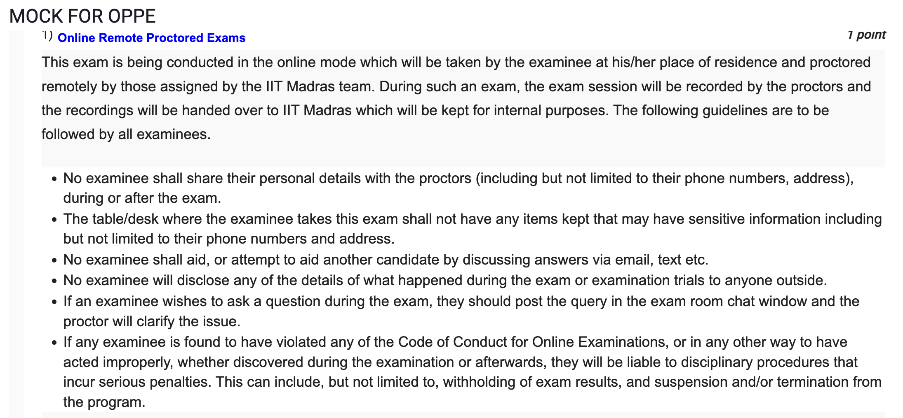

3)
```
from sklearn.datasets import load_breast_cancer

cancer = load_breast_cancer()
# How many features are there in the data set?
print(len(cancer.feature_names))
```
- Ans : 30

4)
```
from sklearn.datasets import load_breast_cancer

cancer = load_breast_cancer()
# How many unique classes are there in the dataset?
print((len(cancer.target_names)))
```
- Ans: 2
5)
```
from sklearn.datasets import load_breast_cancer

cancer = load_breast_cancer()
# How many samples correspond to class 0?
x=cancer.target[cancer.target == 0].shape[0]
print(x)
```
Ans : 212

6)
```
from sklearn.datasets import load_breast_cancer

X,y = load_breast_cancer(as_frame=True,return_X_y=True)
# Is there any categorical feature?
# we need to have it as pandas dataframe to use info()
print(X.info())
```
- Ans : No

7)
```
from sklearn.datasets import load_breast_cancer

X,y = load_breast_cancer(as_frame=True,return_X_y=True)

# What is the pearson correlation between the features 'mean perimeter' and 'mean radius'?
# Round your answer to 3 decimal places.
# Hint: Use the pandas.DataFrame.corr() method.

print(X.corr().loc['mean perimeter','mean radius'].round(3))
```
- Ans : 0.998

8)
```
# Import SimpleImputer from SkLearn library.
# # Take a matrix [[7, 16, 31], [np.nan, np.nan, 66], [12, 5, np.nan],[98, np.nan, 92]].
# #  Impute the missing values in the matrix using SimpleImputer with Mean What is the imputed matrix using fit_transform?

import numpy as np
from sklearn.impute import SimpleImputer

matrix = np.array([[7, 16, 31], [np.nan, np.nan, 66], [12, 5, np.nan],[98, np.nan, 92]])
# print(matrix)

imp = SimpleImputer(missing_values=np.nan, strategy='mean')
imp.fit(matrix)
matrix = imp.transform(matrix)
print(matrix)
```
- Ans : [[ 7. 16. 31. ] [39. 10.5 66. ] [12. 5. 63. ] [98. 10.5 92. ]]


9)
```

# Import FunctionTransformer from the SkLearn library.
# Apply log base 10 to the elements of the following array : [[1, 1], [2, 3],[10,100]] .
# What is the resultant matrix?

from sklearn.preprocessing import FunctionTransformer
import numpy as np

arr = np.array([[1, 1], [2, 3],[10,100]])
# print(arr)

transformer = FunctionTransformer(np.log10)
print(transformer.transform(arr))
```
- Ans : [[0. 0. ] [0.30103 0.47712125] [1. 2. ]]

10)
```
# Read the CSV file from https://archive.ics.uci.edu/ml/machine-learning-databases/iris/iris.data, define the column headers as `'sepal length', 'sepal width', 'petal length', 'petal width','label'.

#     Generate a new feature matrix consisting of all polynomial combinations of the features with degree 2 (For example, if an input sample is two dimensional and of the form [a,b] , the degree-2 polynomial features are
#                                                                                                            What are the shapes of the feature matrix before and after the polynomial transformation?

# What are the shapes of the feature matrix before and after the polynomial transformation?


import pandas as pd
import numpy as np
from sklearn.preprocessing import PolynomialFeatures

df = pd.read_csv('https://archive.ics.uci.edu/ml/machine-learning-databases/iris/iris.data', header=None)
df.columns = ['sepal length', 'sepal width', 'petal length', 'petal width','label']
print(df.shape)
X = df[['sepal length', 'sepal width', 'petal length', 'petal width']]
y = df['label']

poly = PolynomialFeatures(2)
X_poly = poly.fit_transform(X)

print(X_poly.shape)
```
- Ans : (150, 5) (150, 15)

11)
```
# Import the California Housing dataset and SelectPercentile, mutual_info_regression.
# Select features according to 10 percentile of the highest scores What is the shape of the feature matrix after feature selection?

from sklearn.datasets import fetch_california_housing
X,y=fetch_california_housing(return_X_y=True,as_frame=True)
from sklearn.feature_selection import SelectPercentile, mutual_info_regression
sp=SelectPercentile(mutual_info_regression,percentile=10)
new=sp.fit_transform(X,y)
new.shape
```
- Ans : (20640, 1)

12)
```
# Import the California Housing dataset. 
#   Load the features and labels as numpy array. Split the data into training and test data in 4:1 proportion. What will be the size of training features?

from sklearn.datasets import fetch_california_housing
import numpy as np
from sklearn.model_selection import train_test_split

cal_housing = fetch_california_housing()
X = cal_housing.data
y = cal_housing.target

X_train, X_test, y_train, y_test = train_test_split(X, y, test_size=0.2)

print(X_train.shape)

```
- Ans : (16512, 8)


13)
```
# Import the California Housing dataset. 
#   Load the features and labels as numpy array. Split the data into training and test data in 4:1 proportion. What will be the size of training features?

from sklearn.datasets import fetch_california_housing
import numpy as np
from sklearn.model_selection import train_test_split

cal_housing = fetch_california_housing()
X = cal_housing.data
y = cal_housing.target

X_train, X_test, y_train, y_test = train_test_split(X, y, test_size=0.2)

print(X_train.shape)

# Use the strategy 'mean' to predict all the labels. Calculate the coefficient of determination (R2) for the prediction.

from sklearn.dummy import DummyRegressor
from sklearn.metrics import r2_score

dummy = DummyRegressor(strategy='mean')
dummy.fit(X_train, y_train)
y_pred = dummy.predict(X_test)
print(r2_score(y_test, y_pred))
```

- Answer differs for every run, so find out why and how to get the desred answer

14)
```
# Import the California Housing dataset. 
#   Load the features and labels as numpy array. Split the data into training and test data in 4:1 proportion. What will be the size of training features?

from sklearn.datasets import fetch_california_housing
import numpy as np
from sklearn.model_selection import train_test_split

cal_housing = fetch_california_housing()
X = cal_housing.data
y = cal_housing.target

X_train, X_test, y_train, y_test = train_test_split(X, y, test_size=0.2)

print(X_train.shape)

# Fit the training dataset using Iterative Optimization, i.e., SGDRegressor (Keep all the parameters default) after scaling the features using MinMaxscalar.\

#   Calculate the mean absolute error for training data.

from sklearn.linear_model import SGDRegressor
from sklearn.preprocessing import MinMaxScaler
from sklearn.metrics import mean_absolute_error

scaler = MinMaxScaler()
X_train_scaled = scaler.fit_transform(X_train)
X_test_scaled = scaler.transform(X_test)

sgd = SGDRegressor()
sgd.fit(X_train_scaled, y_train)

y_pred = sgd.predict(X_train_scaled)
print(mean_absolute_error(y_train, y_pred))

```
- Ans : 0.5601

15)
```
# Import the California Housing dataset. 
#   Load the features and labels as numpy array. Split the data into training and test data in 4:1 proportion. What will be the size of training features?

from sklearn.datasets import fetch_california_housing
import numpy as np
from sklearn.model_selection import train_test_split

cal_housing = fetch_california_housing()
X = cal_housing.data
y = cal_housing.target

X_train, X_test, y_train, y_test = train_test_split(X, y, test_size=0.2)

print(X_train.shape)

# Fit the training dataset using Iterative Optimization, i.e., SGDRegressor (Keep all the parameters default) after scaling the features using MinMaxscalar.\

#   Calculate the mean absolute error for training data.

from sklearn.linear_model import SGDRegressor
from sklearn.preprocessing import MinMaxScaler
from sklearn.metrics import mean_absolute_error

scaler = MinMaxScaler()
X_train_scaled = scaler.fit_transform(X_train)
X_test_scaled = scaler.transform(X_test)

sgd = SGDRegressor()
sgd.fit(X_train_scaled, y_train)

y_pred = sgd.predict(X_train_scaled)
print(mean_absolute_error(y_train, y_pred))
# Calculate the mean absolute error for test data.

y_pred = sgd.predict(X_test_scaled)
print(mean_absolute_error(y_test, y_pred))

```
- Ans : 0.5601 0.5601

16)
```
# Import the California Housing dataset. 
#   Load the features and labels as numpy array. Split the data into training and test data in 4:1 proportion. What will be the size of training features?

from sklearn.datasets import fetch_california_housing
import numpy as np
from sklearn.model_selection import train_test_split

cal_housing = fetch_california_housing()
X = cal_housing.data
y = cal_housing.target

X_train, X_test, y_train, y_test = train_test_split(X, y, test_size=0.2)

print(X_train.shape)

# Fit the training dataset using Iterative Optimization, i.e., SGDRegressor (Keep all the parameters default) after scaling the features using MinMaxscalar.\

#   Calculate the mean absolute error for training data.

from sklearn.linear_model import SGDRegressor
from sklearn.preprocessing import MinMaxScaler
from sklearn.metrics import mean_absolute_error

scaler = MinMaxScaler()
X_train_scaled = scaler.fit_transform(X_train)
X_test_scaled = scaler.transform(X_test)

sgd = SGDRegressor()
sgd.fit(X_train_scaled, y_train)

y_pred = sgd.predict(X_train_scaled)
# print(mean_absolute_error(y_train, y_pred))
# Calculate the mean absolute error for test data.

y_pred = sgd.predict(X_test_scaled)
# print(mean_absolute_error(y_test, y_pred))

# print the scores that are calculated using 5 fold cross validation using LinearRegression on entire dataset.

from sklearn.linear_model import LinearRegression
from sklearn.model_selection import cross_val_score

lr = LinearRegression()
scores = cross_val_score(lr, X, y, cv=5)
print(scores)

```
- array([0.54866323, 0.46820691, 0.55078434, 0.53698703, 0.66051406])

17)
```
# Import the diabetes dataset from sklearn and check how many samples are there in the dataset?

from sklearn import datasets
import numpy as np
import pandas as pd

diabetes = datasets.load_diabetes()
print(diabetes.data.shape)

```

- Ans : (442, 10)

18)
```

from sklearn.datasets import load_diabetes

diabetes = load_diabetes()
# Step-1: Use Standard scaler to preprocess the data.
#   Step-2: Split the dataset in such a way that 20% data is taken for test cases.(set random state=10)
#   Step-3: Use the LinearRegression() estimator to predict the output.
# What is the R 2  score you got using LinearRegression estimator on test data.

from sklearn.preprocessing import StandardScaler
from sklearn.model_selection import train_test_split
from sklearn.linear_model import LinearRegression
from sklearn.metrics import r2_score

scaler = StandardScaler()
X = scaler.fit_transform(diabetes.data)
y = diabetes.target
X_train, X_test, y_train, y_test = train_test_split(X, y, test_size=0.2, random_state=10)
lr = LinearRegression()
lr.fit(X_train, y_train)
y_pred = lr.predict(X_test)
print(r2_score(y_test, y_pred))

```

- Ans : 0.5341988244945842

19)

```

from sklearn.datasets import load_diabetes

diabetes = load_diabetes()
# Step-1: Use Standard scaler to preprocess the data.
#   Step-2: Split the dataset in such a way that 20% data is taken for test cases.(set random state=10)
#   Step-3: Use the LinearRegression() estimator to predict the output.
# What is the R 2  score you got using LinearRegression estimator on test data.
# What is the value of cofficient associated with variable "s3"?
from sklearn.preprocessing import StandardScaler
from sklearn.model_selection import train_test_split
from sklearn.linear_model import LinearRegression
from sklearn.metrics import r2_score

scaler = StandardScaler()
X = scaler.fit_transform(diabetes.data)
y = diabetes.target
X_train, X_test, y_train, y_test = train_test_split(X, y, test_size=0.2, random_state=10)
lr = LinearRegression()
lr.fit(X_train, y_train)
y_pred = lr.predict(X_test)
print(lr.coef_[diabetes.feature_names.index('s3')])
```
