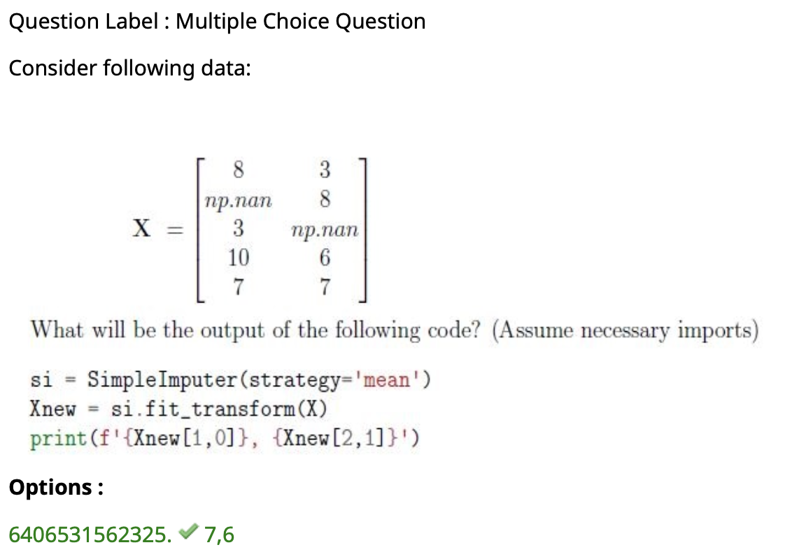
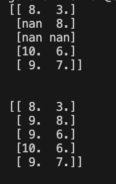
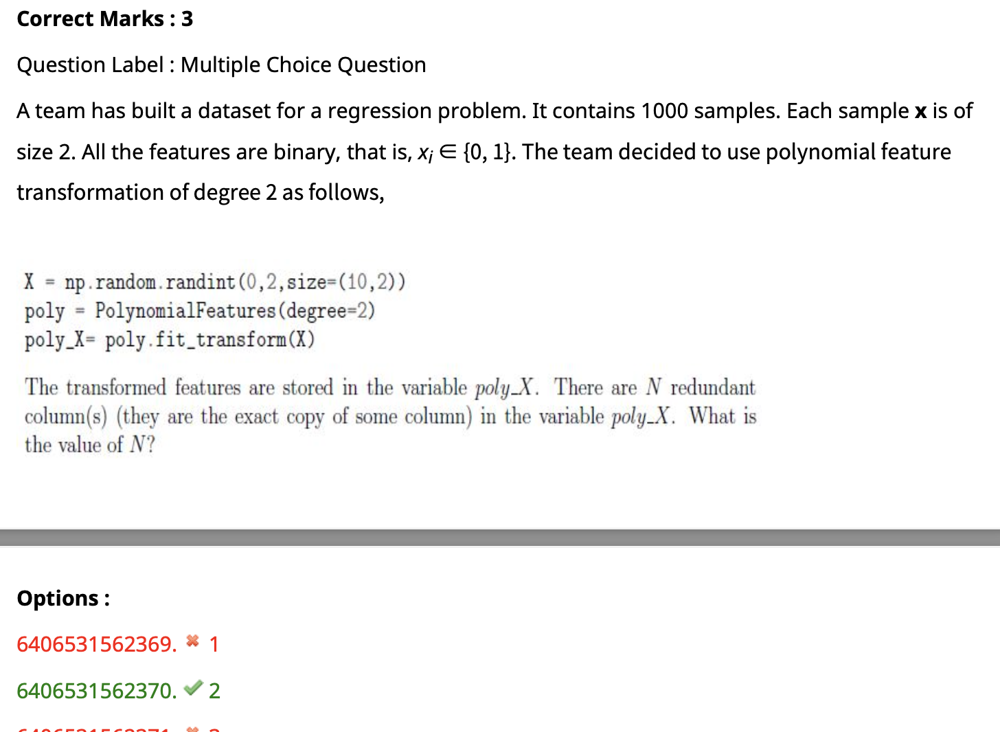

- check out the below




```
from sklearn.impute import SimpleImputer
import numpy as np

lis=[[8,np.nan,np.nan,10,9],[3,8,np.nan,6,7]]

X=np.array(lis)
X=X.T
print(X)
imp=SimpleImputer(missing_values=np.nan,strategy='mean')
imp.fit(X)
print()
print()
print(imp.transform(X))
```

3) For question regarding dropna(how="all")
```
import pandas as pd

# Creating a DataFrame with some missing values
data = {'A': [None, 2, None, 4],
        'B': [None, None, None, 3],
        'D': [None, 10, 11, 12],
        'C': [None, 6, 7, 8]}
df = pd.DataFrame(data)

# Dropping rows with missing values in all columns
df_dropped = df.dropna(how='all')

print(df_dropped)

```

```
from sklearn.preprocessing import PolynomialFeatures
import numpy as np
X=np.random.randn(2,2)
poly=PolynomialFeatures(degree=2,interaction_only=True)
poly_x=poly.fit_transform(X)
print(X)

print("\n\n")

print(poly_x)
````

