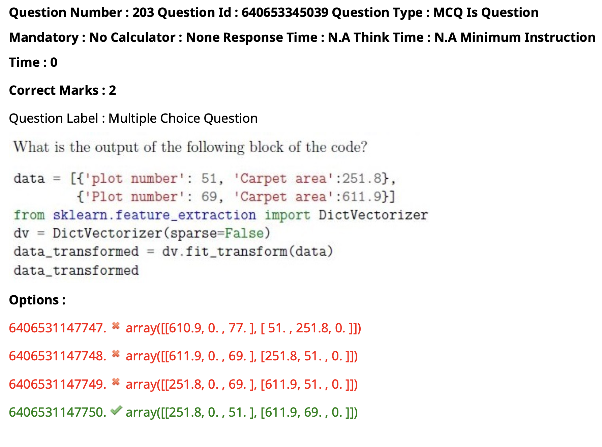

```
data=[{'Plot number':51,"Carpet area":251.8},
      {'plot number':69,'Carpet area':611.9}
    ]
from sklearn.feature_extraction import DictVectorizer
dv=DictVectorizer(sparse=False)
data_transformed=dv.fit_transform(data)
print(data_transformed)

x=sorted(['a','A','1'])
print(x)
# ['1', 'A', 'a']
```

- for this question , the keys are sorted in ascending order and then dict is vectorized, 

- ['1', 'A', 'a']