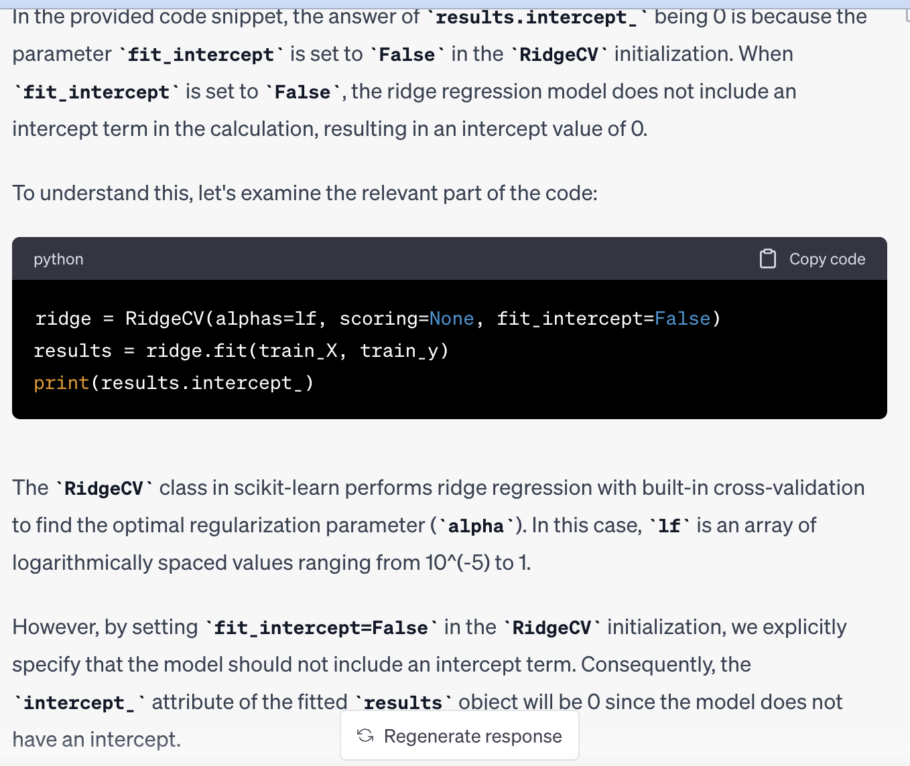

```
from sklearn.preprocessing import PolynomialFeatures
from sklearn.pipeline import Pipeline
from sklearn.preprocessing import StandardScaler
from sklearn.linear_model import RidgeCV
from sklearn.datasets import load_diabetes
import numpy as np

diabetes=load_diabetes(as_frame=True)
train_X=diabetes.data
train_y=diabetes.target

lf=np.logspace(-5,0,num=6)
print(lf)
reg=Pipeline([('poly',PolynomialFeatures(degree=2)),
              ("feature_scaling",StandardScaler())
               ])
ridge=RidgeCV(alphas=lf,scoring=None,fit_intercept=False)
results=ridge.fit(train_X,train_y)
print(results.intercept_)
```




```
from sklearn.preprocessing import PolynomialFeatures
from sklearn.pipeline import Pipeline
from sklearn.preprocessing import StandardScaler
from sklearn.linear_model import RidgeCV
from sklearn.datasets import load_diabetes
import numpy as np

from sklearn.linear_model import SGDRegressor
from sklearn.pipeline import make_pipeline
n_samples,n_features=18,4
rng=np.random.RandomState(0)
y=rng.randn(n_samples)
X=rng.randn(n_samples,n_features)
reg=SGDRegressor(max_iter=1000,tol=1e-3,eta0=0.04,power_t=5,
                 n_iter_no_change=3,validation_fraction=0.03,random_state=42)

reg.fit(X,y)
print(reg.coef_)
```