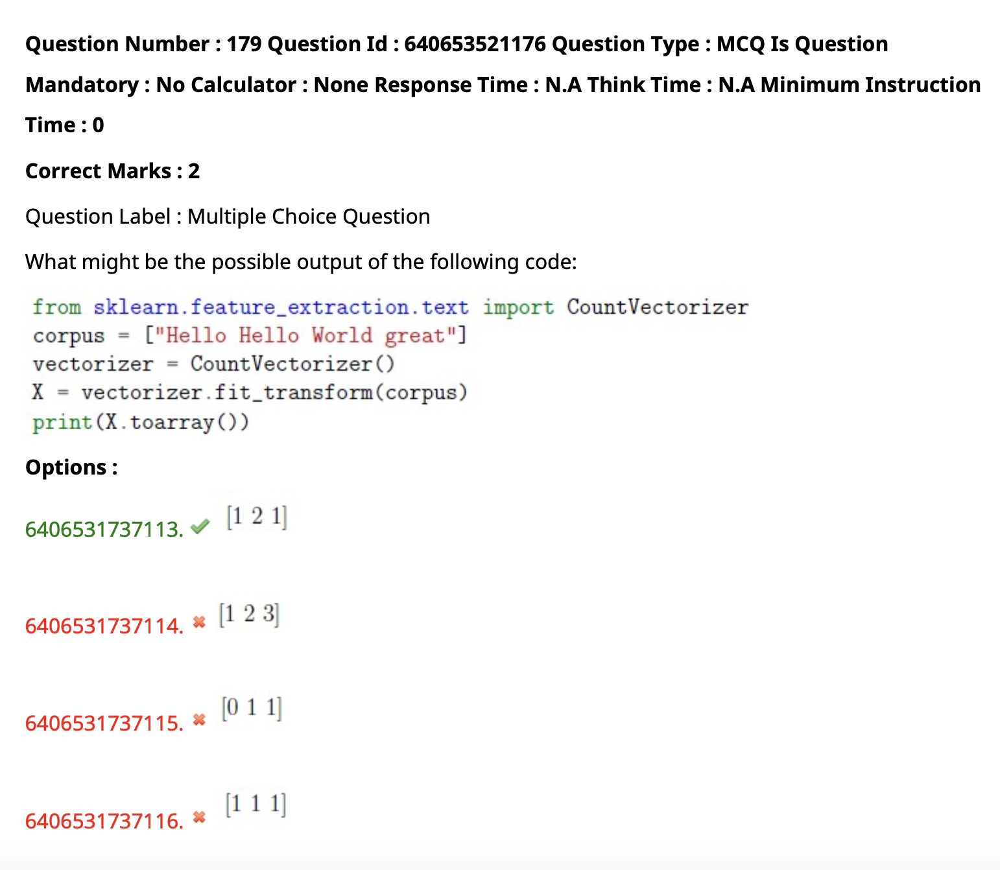
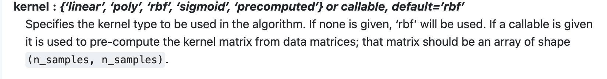

    - sag and saga are gradient descent based solvers
    - sag is stochastic average gradient descent
    - saga is stochastic average gradient descent with adaptive learning rate
    - sag and saga are faster than lbfgs for large datasets


- continuous
    - y is an array of floats that are not all integers and is 1d or a column vector
    - eg [1.0,2.3,3.1]
- continuous-multioutput
    - y is a 2d array of floats that are not all integers
    - eg [[1.0,2.3,3.1],[1.0,2.3,3.1]]
- binary
    - y contains <= 2 discrete values and is 1d or a column vector
    - eg [0,1,1,0]
- multiclass
    - y contains > 2 discrete values and is 1d or a column vector
    - eg [0,1,2,3]
- multiclass-multioutput
    - y is a 2d array that contains > 2 discrete values
- eg: if the 2d array has only two unique values or numbers inside it is `multilabel-indicator`
- eg: if the 2d array has more than two unique values or numbers inside it is `multiclass-multioutput`
- multilabel-indicator
    - y is a label indicator matrix, an array of two dimensions with at least two columns that are of the same length as y
    - eg [[1,0,0],[0,1,1]]

```
from sklearn.utils.multiclass import type_of_target
import numpy as np
type_of_target([0.1, 0.6])
type_of_target([1, -1, -1, 1])
type_of_target(['a', 'b', 'a'])
type_of_target([1.0, 2.0])
type_of_target([1, 0, 2])
type_of_target([1.0, 0.0, 3.0])
type_of_target(['a', 'b', 'c'])
type_of_target(np.array([[1, 2], [3, 1]]))
type_of_target([[1, 2]])
type_of_target(np.array([[1.5, 2.0], [3.0, 1.6]]))
type_of_target(np.array([[0, 1], [1, 1]]))
```


```
from sklearn.linear_model import SGDClassifier
from sklearn.datasets import make_classification
from sklearn.model_selection import train_test_split

# Create a synthetic dataset
X, y = make_classification(n_samples=1000, n_features=2, n_informative=2, n_redundant=0, random_state=42)

# Split the dataset into training and testing sets
X_train, X_test, y_train, y_test = train_test_split(X, y, test_size=0.2, random_state=42)

# Create an instance of SGDClassifier with different batch sizes for each variant

# Full Batch Gradient Descent (batch_size equals the whole dataset size)
sgd_full_batch = SGDClassifier(loss='log', alpha=0.001, max_iter=1000, tol=1e-3, random_state=42, batch_size=len(X_train))
sgd_full_batch.fit(X_train, y_train)

# Mini Batch Gradient Descent (batch_size is a smaller value)
sgd_mini_batch = SGDClassifier(loss='log', alpha=0.001, max_iter=1000, tol=1e-3, random_state=42, batch_size=50)
sgd_mini_batch.fit(X_train, y_train)

# Stochastic Gradient Descent (batch_size equals 1)
sgd_stochastic = SGDClassifier(loss='log', alpha=0.001, max_iter=1000, tol=1e-3, random_state=42, batch_size=1)
sgd_stochastic.fit(X_train, y_train)

```


- Suppose we have a multi-class classification problem with n classes. Which of the following methods require exactly n classifiers to solve this problem?

- OneVsRestClassifier is a meta-estimator that fits one classifier per class. For each classifier, the class is fitted against all the other classes. In addition to its computational efficiency (only n_classes classifiers are needed), OneVsRestClassifier is a useful strategy for multi-label classification, without having to transform a multi-label problem into multiple binary classification problems. This method requires exactly n classifiers to solve the problem.

- OneVsOneClassifier needs n * (n - 1) / 2 classifiers to solve the problem.
    - OneVsOneClassifier constructs one classifier per pair of classes. At prediction time, the class which received the most votes is selected. In the event of a tie (among two classes with an equal number of votes), it selects the class with the highest aggregate classification confidence by summing over the pair-wise classification confidence levels computed by the underlying binary classifiers. This method requires n * (n - 1) / 2 classifiers to solve the problem.

- OutputCodeClassifier constructs one classifier per class. At fitting time, the classifier is trained in a one-vs-rest fashion, using the original multi-class problem, while at prediction time, the class which received the most votes is selected. In the event of a tie, it selects the class with the highest aggregate classification confidence by summing over the pair-wise classification confidence levels computed by the underlying binary classifiers. This method requires n * (n - 1) / 2 classifiers to solve the problem.

- MultiOutputClassifier fits one classifier per target. This method requires n classifiers to solve the problem.

- # EXPLore HOw



```
from sklearn.feature_extraction.text import CountVectorizer
corpus=['Hello hello World great']
vectorizer=CountVectorizer()
X=vectorizer.fit_transform(corpus)
print(X.toarray())
```
- even the small and capital lettered words  gives the same result


- self explanatory


```
from sklearn.metrics import mean_absolute_error
y_true = [3, -0.5, 2, 7]
y_pred = [2.5, 0.0, 2, 8]
mean_absolute_error(y_true, y_pred)
y_true = [[0.5, 1], [-1, 1], [7, -6]]
y_pred = [[0, 2], [-1, 2], [8, -5]]
mean_absolute_error(y_true, y_pred)
mean_absolute_error(y_true, y_pred, multioutput='raw_values')
mean_absolute_error(y_true, y_pred, multioutput=[0.3, 0.7])
```

- find the absolute errors and then mean of them


tp=4

tp+fp=6 (all the predicted positives)

tp+fn=5 (all the actual positives)

- precision = tp/(tp+fp)


- Feature scaling does not impact KNN model performance
  - False , it does impact the performance of KNN model as it is distance based algorithm and distance is calculated between the points so if the features are not scaled then the distance will be calculated in different scales and the model will not perform well

- 


- a) 'n_estimators'- not in quotes
- b) param_distribution is given as a list and not a dictionary
- c) same as b)
- d) it the correct way to give the parameters
    - n_estimators is given in quotes
    - param_distribution is given as a dictionary

- 
    - Decision Trees are prone to:
        - Overfitting ( high variance )
            - High variance means that the model is very sensitive to the training data and it will not generalize well on the test data
        - low bias
            - Low bias means that the model is not biased towards any particular class and it will not generalize well on the test data


- range 10
- cv 10
- total 100


Note:
    - recall will be on the y axis
    - precision will be on the x axis

- # how????


Which of the following option(s) are correct regarding regularization?
Options :
- regularization is used to avoid overfitting of the model by penalizing the model for having large weights and thus reducing the variance of the model and increasing the bias of the model 

- 6406531737109.   It is a technique used to minimize the adjusted loss function and avoid overfitting.
    - Regularization is a technique used to minimize the adjusted loss function and avoid overfitting.
    - 
- 6406531737110.   It increases the bias and variance of the training model
    - Regularization is a technique used to minimize the adjusted loss function and avoid overfitting. It increases the bias and reduces the variance of the training model.

- 6406531737111.   Elastic net regularization is a combination of L1 and L2 regularization both.
    - Elastic net regularization is a combination of L1 and L2 regularization both. It is used to avoid overfitting of the model by penalizing the model for having large weights and thus reducing the variance of the model and increasing the bias of the model.
    
- 6406531737112.   It controls the number of passes a training dataset takes in an algorithm.
    - it is not true for regularization  but for epochs in neural networks  it is true 


- https://towardsdatascience.com/k-nearest-neighbors-94395f445221#:~:text=When%20the%20value%20of%20K,decision%20boundary%20as%20shown%20above.





# HOW?


```
from sklearn.datasets import load_breast_cancer
from sklearn.tree import DecisionTreeClassifier
from sklearn.model_selection import train_test_split
X, y = load_breast_cancer(return_X_y=True,as_frame=True)
X_train, X_test, y_train, y_test = train_test_split(X, y, random_state=1,test_size=0.2)
clf = DecisionTreeClassifier(random_state=5,min_samples_leaf=5,min_samples_split=3)
clf.fit(X_train, y_train)
print(clf.score(X_test, y_test))
```
# HOW ???\

