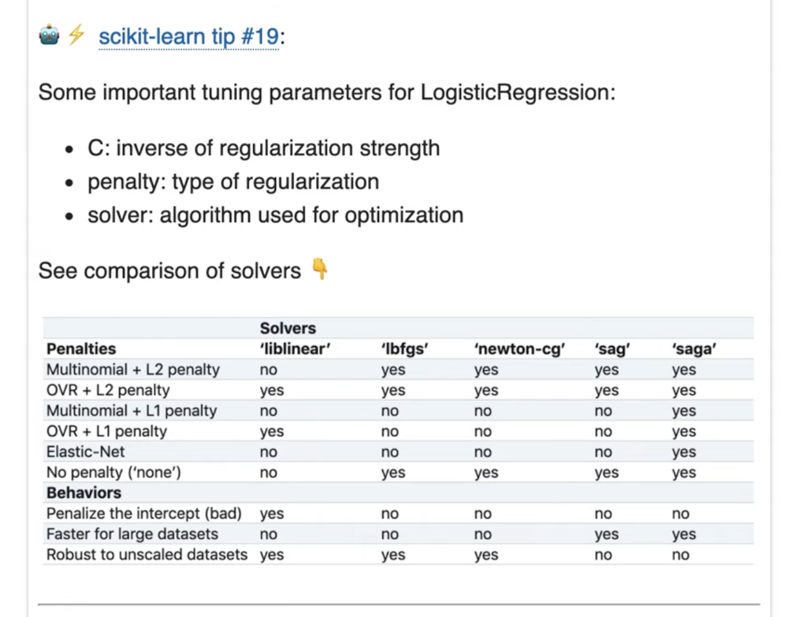

- What is SAG(Stochastic Average Gradient)?
    - https://www.youtube.com/watch?v=3LQbbvt5Ass
    - 
- What is the differnce among these solvers?
- What is newton-sg solver?
- what is lbfgs?
- what is liblinear solver?
- What is SAG solver?
- What is saga solver?

