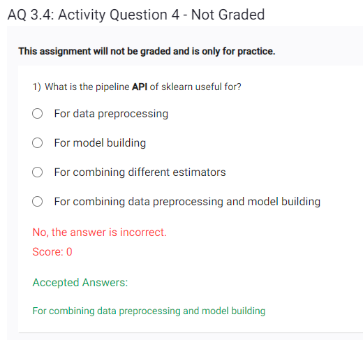

- https://discourse.onlinedegree.iitm.ac.in/t/aq-3-4-q1/94227


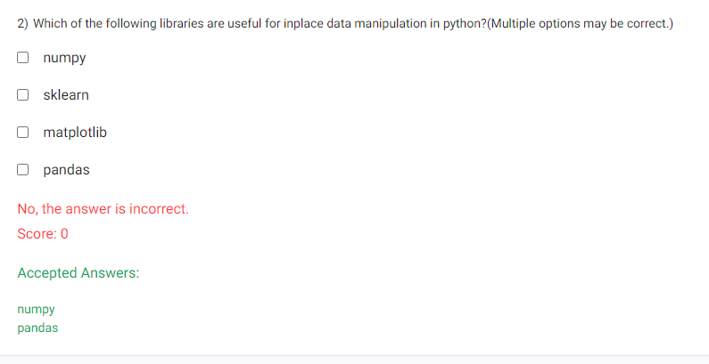

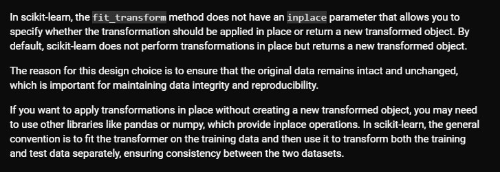
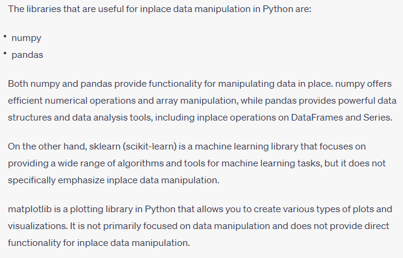
- https://chat.openai.com/share/322dc77b-866a-4b27-9d15-5d17a4437372 - use this link to get an example code , which proves we dont have inplace option in simple imputer


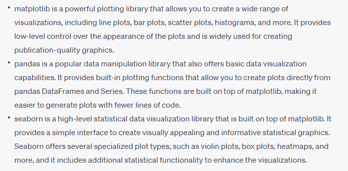
Below is an example for visualization with pandas
```
import pandas as pd

# Create a DataFrame
data = pd.DataFrame({'Category': ['A', 'B', 'C'], 'Value': [10, 15, 7]})

# Create a bar plot using pandas
data.plot.bar(x='Category', y='Value')
```
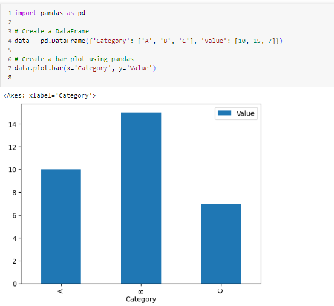

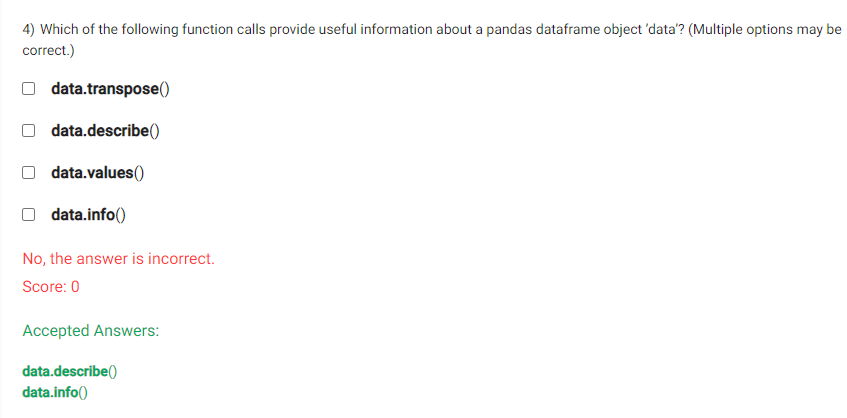

```
import pandas as pd

data = pd.Series([1, 2, 3, 4, 5])
values_array = data.values

print(values_array)

```
- Also note that values is not callable, its just like shape

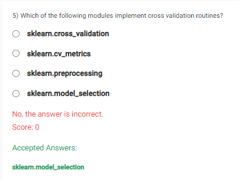
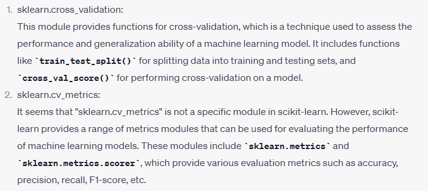
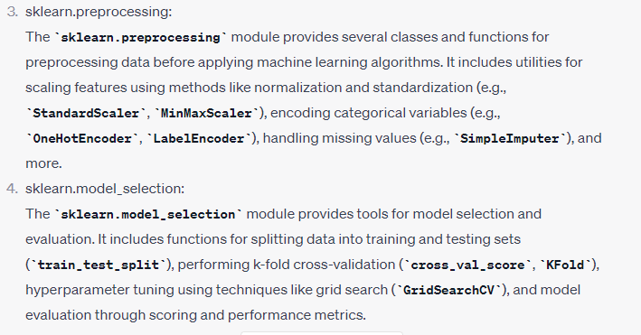
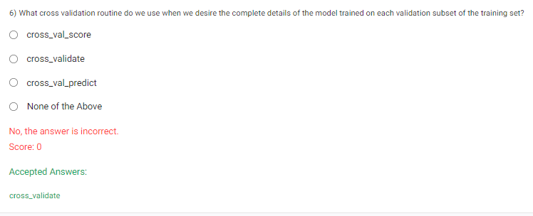


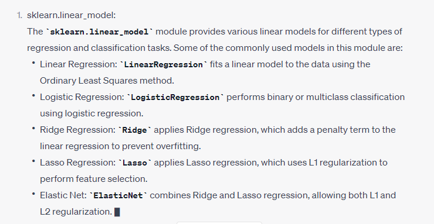
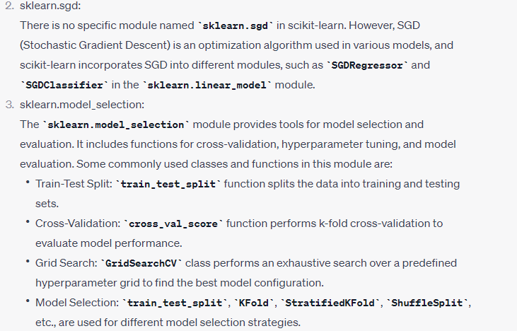


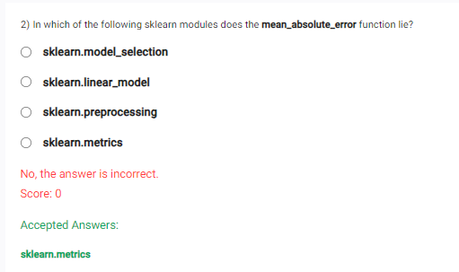
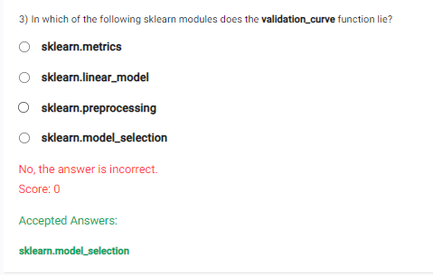
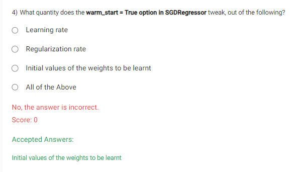

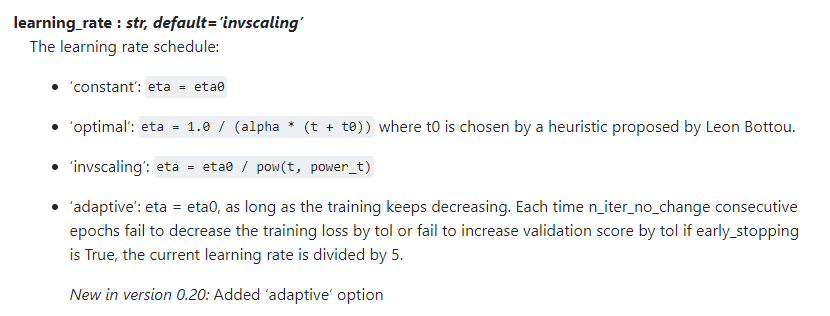
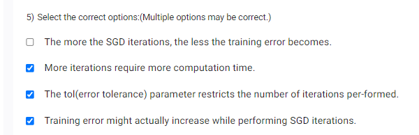
- a) not necessarily