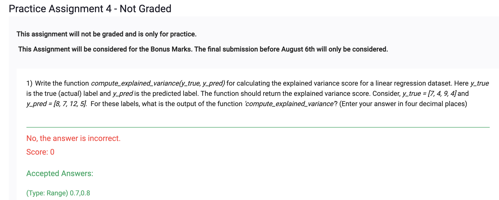
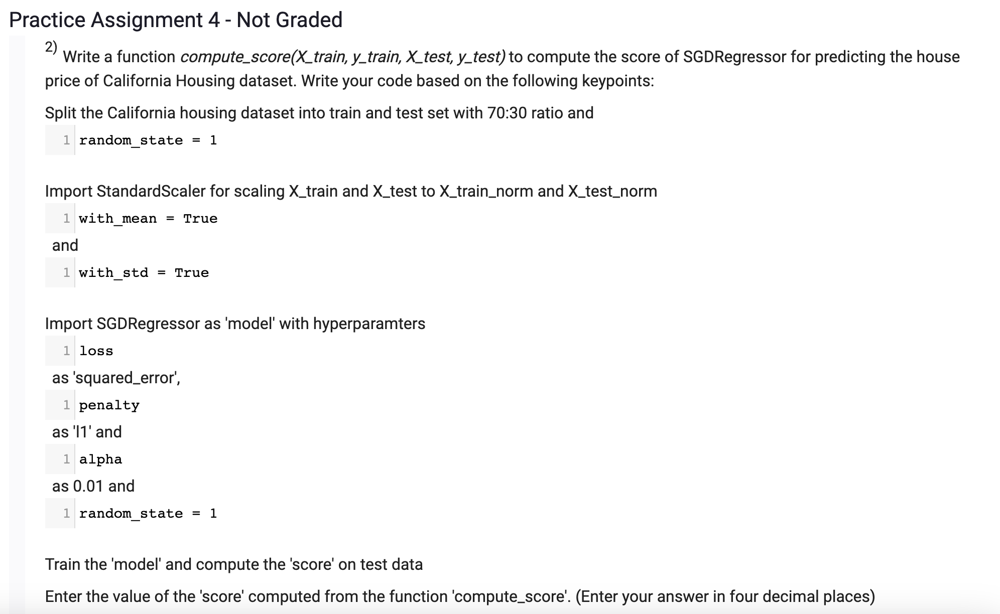
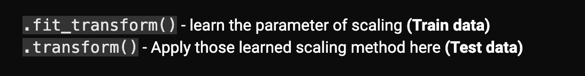

```
from sklearn.metrics import explained_variance_score

def compute_explained_variance(y_true, y_pred):
    return explained_variance_score(y_true, y_pred)

y_true = [7, 4, 9, 4]
y_pred = [8, 7, 12, 5]

explained_variance = compute_explained_variance(y_true, y_pred)
print(f"Explained Variance: {explained_variance:.4f}")

```
    Explained Variance: 0.7778




```
def compute_score(X_train, y_train, X_test, y_test):
    from sklearn.linear_model import SGDRegressor
    from sklearn.preprocessing import StandardScaler

    ss = StandardScaler(with_mean = True, with_std = True)

    X_train_norm = ss.fit_transform(X_train)
    X_test_norm = ss.transform(X_test)

    sgd_reg = SGDRegressor(loss='squared_error', penalty='l1', alpha=0.01, random_state = 1)
    sgd_reg.fit(X_train_norm, y_train)

    # y_pred = sgd_reg.predict(X_test_t, y_test)

    score = sgd_reg.score(X_test_norm, y_test)
    return score

from sklearn.datasets import fetch_california_housing
from sklearn.model_selection import train_test_split

X, y = fetch_california_housing(return_X_y = True)
X_train, X_test, y_train, y_test = train_test_split(X, y, test_size = 0.3, random_state = 1)

ans = compute_score(X_train, y_train, X_test, y_test)
np.round(ans,4)
```
    0.5951

## Point to remember
- https://discourse.onlinedegree.iitm.ac.in/t/week-4-pa-question-2/78323
- we have to use just .transform for test data instead of .fit_transform
Change `X_test_norm = ss.fit_transform(X_test) to X_test_norm = ss.transform(X_test)`

    