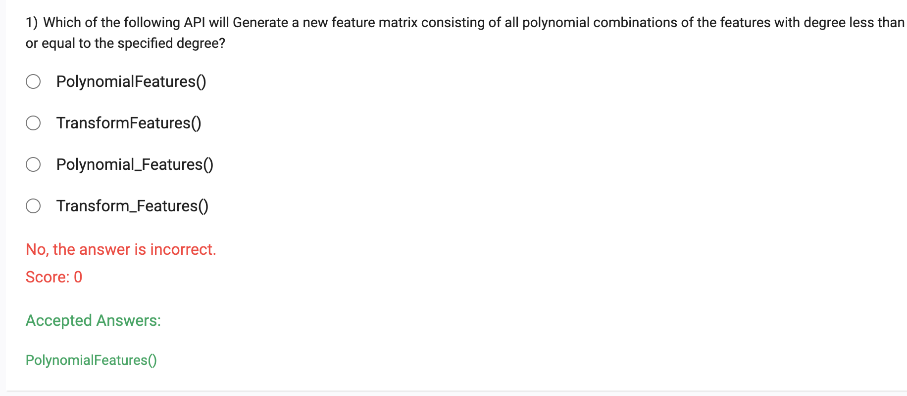
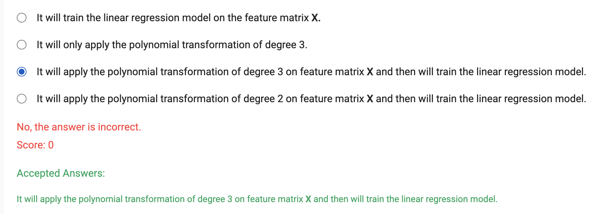
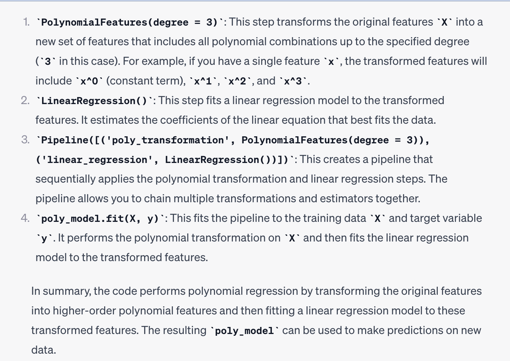
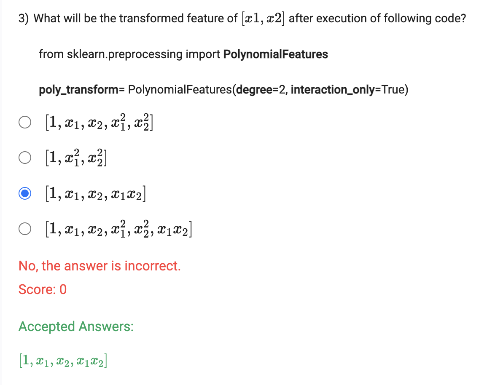
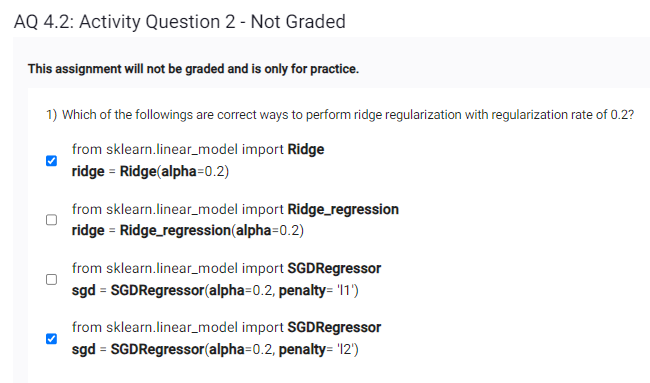
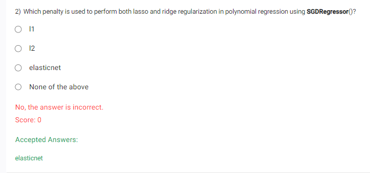
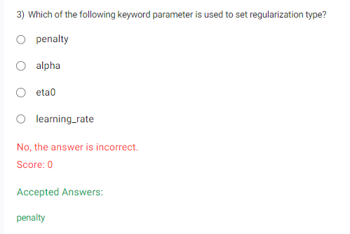
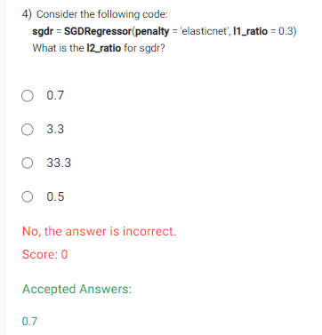
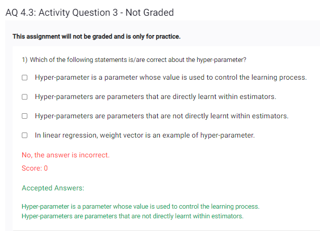

Week 4 AQ 1: 

2) 

What will following code implement?
```
    from sklearn.linear_model import LinearRegression
    from sklearn.pipeline import Pipeline
    from sklearn.preprocessing import PolynomialFeatures

    poly_model = Pipeline([('poly_transformation', PolynomialFeatures(degree = 3)), 
                                           
                                             ('linear_regression', LinearRegression())])

    poly_model.fit(X, y)
```
where X and y are the feature matrix and label-vector, respectively.



```
  from sklearn.preprocessing import PolynomialFeatures

       poly_transform= PolynomialFeatures(degree=2, interaction_only=True)
```
```
from sklearn.preprocessing import PolynomialFeatures

# Original feature vector
X = [[1, 2]]

# Create PolynomialFeatures transformer
poly_transform = PolynomialFeatures(degree=2, interaction_only=True)

# Apply transformation
X_transformed = poly_transform.fit_transform(X)

# Print the transformed feature vector
print(X_transformed)


[[1. 1. 2. 2.]]
```


- l2 is ridge and l1 is lasso regression






- 1 - l1_ratio=l2_ratio

