Week 4 AQ 1: 

2) 

What will following code implement?
```
    from sklearn.linear_model import LinearRegression
    from sklearn.pipeline import Pipeline
    from sklearn.preprocessing import PolynomialFeatures

    poly_model = Pipeline([('poly_transformation', PolynomialFeatures(degree = 3)), 
                                           
                                             ('linear_regression', LinearRegression())])

    poly_model.fit(X, y)
```
where X and y are the feature matrix and label-vector, respectively.


```
  from sklearn.preprocessing import PolynomialFeatures

       poly_transform= PolynomialFeatures(degree=2, interaction_only=True)
```

```
from sklearn.preprocessing import PolynomialFeatures

# Original feature vector
X = [[1, 2]]

# Create PolynomialFeatures transformer
poly_transform = PolynomialFeatures(degree=2, interaction_only=True)

# Apply transformation
X_transformed = poly_transform.fit_transform(X)

# Print the transformed feature vector
print(X_transformed)


[[1. 1. 2. 2.]]
```


- l2 is ridge and l1 is lasso regression


- 1 - l1_ratio=l2_ratio


- how option d ??

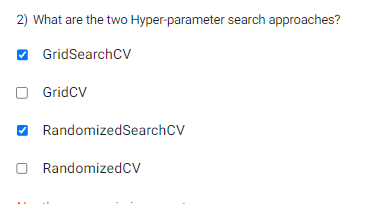

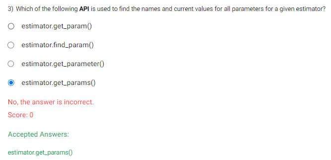


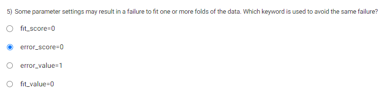

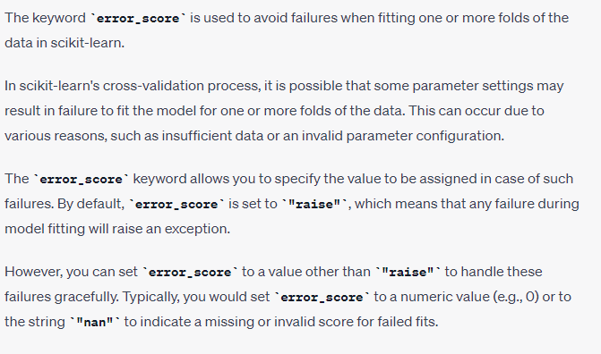

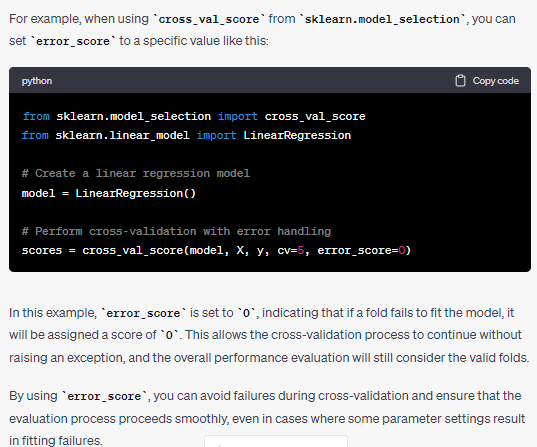

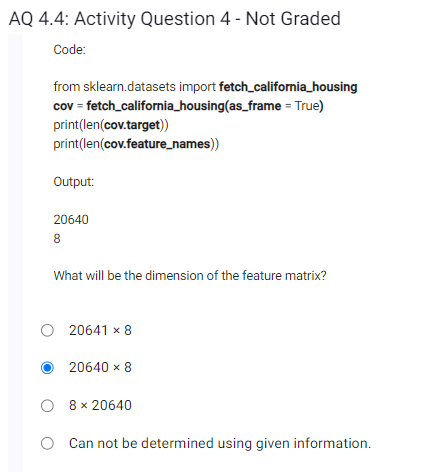

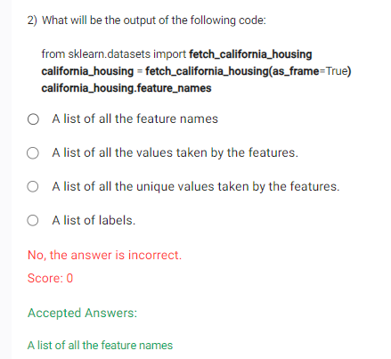

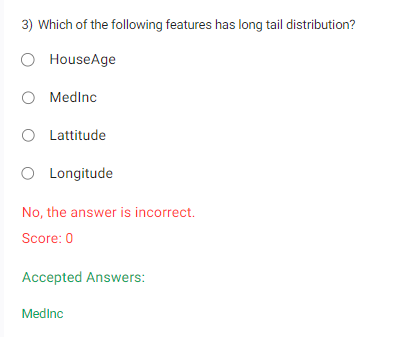
```
import matplotlib.pyplot as plt
import numpy as np
from scipy.stats import skew
from sklearn.datasets import fetch_california_housing

# Load the California Housing dataset
california_housing = fetch_california_housing()
data = california_housing.data
feature_names = california_housing.feature_names

# Create subplots for plotting histograms
fig, axes = plt.subplots(nrows=4, ncols=2, figsize=(12, 16))

# Plot histograms for each feature
for i, ax in enumerate(axes.flatten()):
    ax.hist(data[:, i], bins=20)
    ax.set_title(feature_names[i])

# Calculate skewness for each feature
skewness = [skew(data[:, i]) for i in range(data.shape[1])]

# Print skewness values
for i, feature in enumerate(feature_names):
    print("Skewness of", feature, ":", skewness[i])

# Show the plots
plt.tight_layout()
plt.show()
```
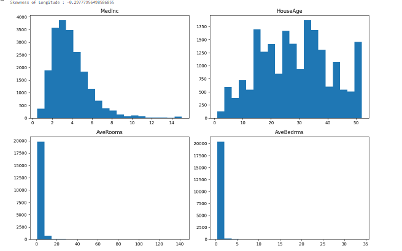

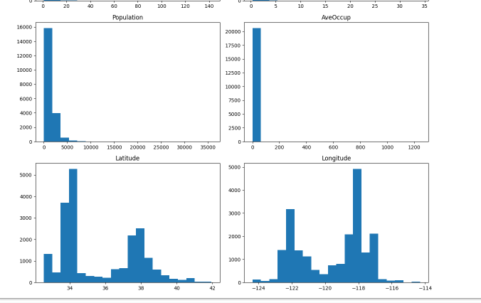

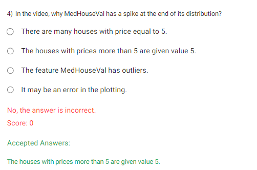

- because thats how the data is in the dataset,check discourse

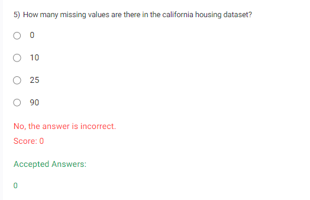

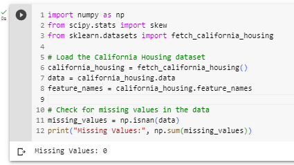

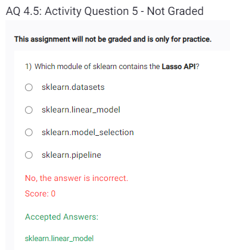

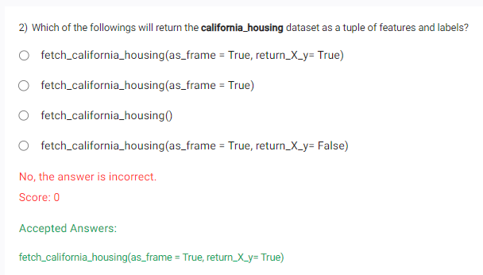

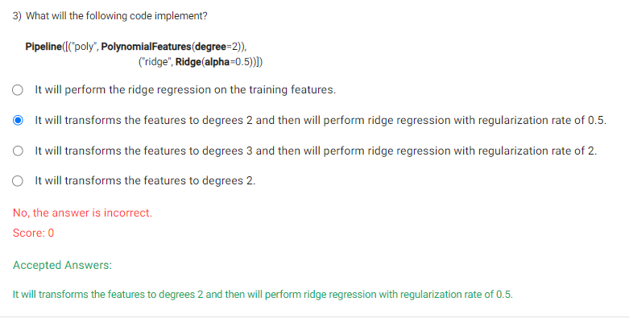

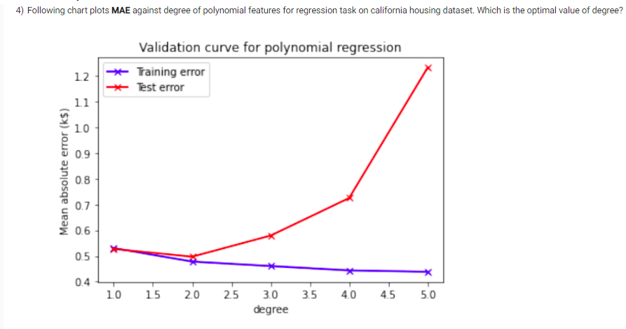

How and why 2?

