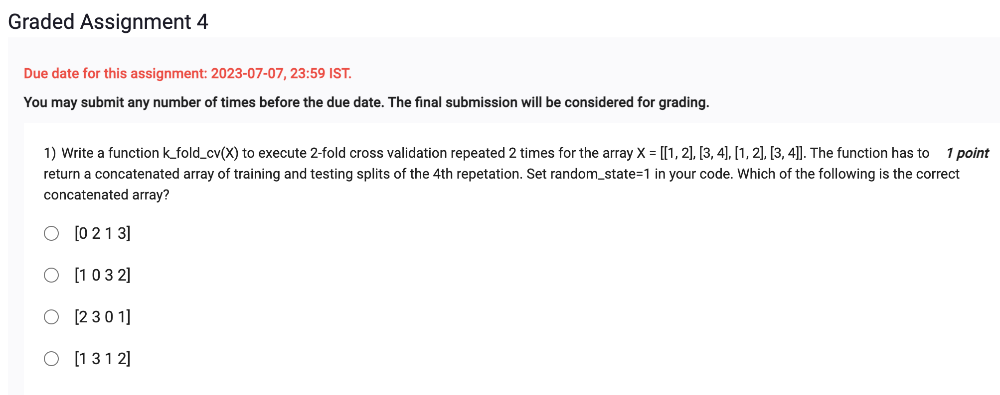
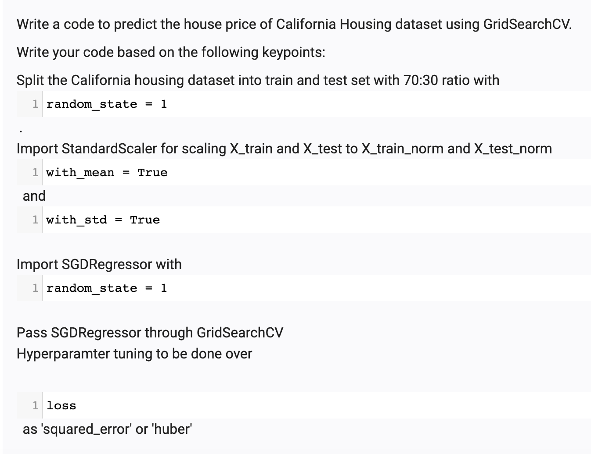
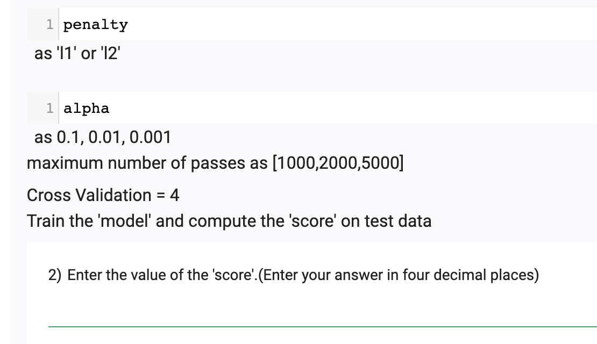

```
from sklearn.model_selection import RepeatedKFold
import numpy as np

def k_fold_cv(X):
    rkf = RepeatedKFold(n_splits=2, n_repeats=2, random_state=1)
    splits = []
    for train_index, test_index in rkf.split(X):
        splits.append((train_index, test_index))
    return np.concatenate(splits[3], axis=None)

X = [[1, 2], [3, 4], [1, 2], [3, 4]]
print(k_fold_cv(X))

```
```
[0 2 1 3]
```

2) 


```
import numpy as np
from sklearn.datasets import fetch_california_housing
from sklearn.model_selection import train_test_split, GridSearchCV
from sklearn.preprocessing import StandardScaler
from sklearn.linear_model import SGDRegressor
from sklearn.metrics import r2_score

# Load the California Housing dataset
data = fetch_california_housing()
X = data.data
y = data.target

# Split the dataset into train and test sets
X_train, X_test, y_train, y_test = train_test_split(X, y, test_size=0.3, random_state=1)

# Scale the features using StandardScaler
scaler = StandardScaler(with_mean=True, with_std=True)
X_train_norm = scaler.fit_transform(X_train)
X_test_norm = scaler.transform(X_test)

# Define the parameter grid for hyperparameter tuning
param_grid = {
    'loss': ['squared_error', 'huber'],
    'penalty': ['l1', 'l2'],
    'alpha': [0.1, 0.01, 0.001],
    'max_iter': [1000, 2000, 5000]
}

# Create an instance of the SGDRegressor
sgd = SGDRegressor(random_state=1)

# Perform grid search using GridSearchCV
grid_search = GridSearchCV(sgd, param_grid, cv=4)

# Fit the model
grid_search.fit(X_train_norm, y_train)

# Get the best model and its score on the test set
best_model = grid_search.best_estimator_
y_pred = best_model.predict(X_test_norm)
score = r2_score(y_test, y_pred)

# Print the score
print(f"Score: {score:.4f}")

```