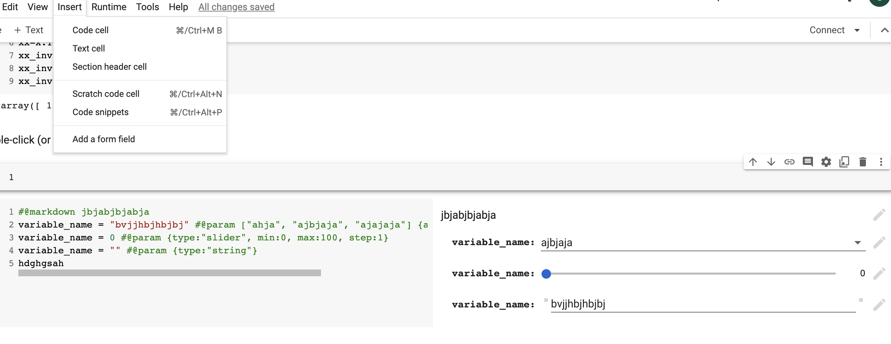

# IN colab 
    - ctrl + m + b : insert cell below
    - ctrl + m + a : insert cell above
    - ctrl + m + d : delete cell
    - ctrl + m + m : change cell to markdown
    - ctrl + m + y : change cell to code
    - ctrl + m + h : show keyboard shortcuts
    - ctrl + m + p : command palette
    - ctrl + m + s : save notebook
    - ctrl + m + f : find and replace
    - ctrl + m + l : toggle line numbers
    - ctrl + m + o : toggle output
    - ctrl + m + i : interrupt kernel
    - ctrl + m + . : restart kernel
    - ctrl + m + z : undo cell deletion
    - ctrl + m + shift + p : open command palette

- we have option to insert add a form field in colab, we have 4 different form fields which will help us change the values of variables dynamically
    - text field
    - markdown
    - dropdown
    - slider
    

- we have an option to insert code snippets in colab, we have 4 different code snippets which will help us write code faster
    - for loop
    - if statement
    - while loop
    - function

- to insert a code snipper, click in insert -> code snippet -> select the code snippet you want to insert
