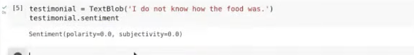

subjectivity
    - for each sentence, calculate the subjectivity score
    - if subjectivity score > 0.5, then the sentence is subjective
    - if subjectivity score < 0.5, then the sentence is objective
    - if subjectivity score = 0.5, then the sentence is neutral
    - if subjectivity score = 0, then the sentence is highly objective
    - if subjectivity score = 1, then the sentence is highly subjective
    - subjectivity means how much the sentence is opinionated or emotional
    - subjectivity score is between 0 and 1
    - if the sentence is objective, then it is a fact or information or news 

# Sentiment Analysis

- the following libraries are used for sentiment analysis
    - textblob
    - nltk
    - vaderSentiment ( full form: Valence Aware Dictionary and sEntiment Reasoner )
    - flair
    - transformers

- lets look at textblob

```
from textblob import TextBlob
text = "I am happy today. I feel sad today."
blob = TextBlob(text)
print(blob.sentences)
print(blob.sentences[0].sentiment)
print(blob.sentences[1].sentiment)
print(blob.sentiment)
```

- the output is as follows

```
[Sentence("I am happy today."), Sentence("I feel sad today.")]
Sentiment(polarity=0.8, subjectivity=1.0)
Sentiment(polarity=-0.5, subjectivity=1.0)
Sentiment(polarity=0.15000000000000002, subjectivity=1.0)
```

- the polarity is between -1 and 1
- the subjectivity is between 0 and 1
- the polarity is the sentiment score of the sentence
- the subjectivity is the subjectivity score of the sentence
- the polarity of the first sentence is 0.8, which means the sentence is positive
- the polarity of the second sentence is -0.5, which means the sentence is negative
- the polarity of the third sentence is 0.15, which means the sentence is positive
- the subjectivity of all the sentences is 1, which means all the sentences are subjective ( opinionated or emotional )



- there is something called bigram, which means two words together
    - for example, "I am happy today" is a bigram
    - "I am" is a bigram
    - "am happy" is a bigram
    - "happy today" is a bigram
    - "today I" is a bigram

- count vectorizer vs tfidf vectorizer
    - count vectorizer counts the number of times a word appears in a document
    - tfidf vectorizer counts the number of times a word appears in a document and also gives importance to the word based on how many times the word appears in other documents
    - tfidf vectorizer is better than count vectorizer because it gives importance to the word based on how many times the word appears in other documents

- what is laplase smoothing
    - laplase smoothing is used to avoid zero frequency problem in naive bayes
    - we add 1 to the numerator and add the number of classes to the denominator
    - for example, if there are 3 classes, then we add 3 to the denominator and add 1 to the numerator
    - if there are 4 classes, then we add 4 to the denominator and add 1 to the numerator 
    - This way we avoid zero frequency problem in naive bayes

- tfidf vectorizer is used to convert text to numbers
    - term frequency
        - term frequency is the number of times a word appears in a document
        - term frequency is calculated for each word in each document
    - inverse document frequency
        - inverse document frequency is the number of times a word appears in all the documents
        - inverse document frequency is calculated for each word in all the documents
        - https://youtu.be/27G4drv3Nfk?t=3481 
        