- All three are valid strategy parameter for dummy regressor


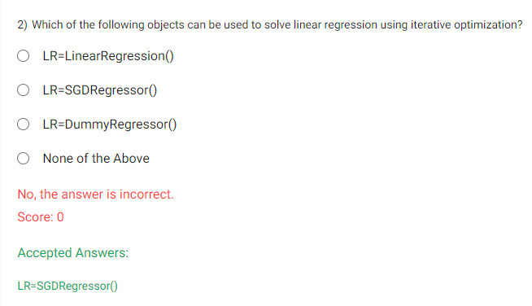


- Note : LinearRegression() is from `sklearn.linear_model`


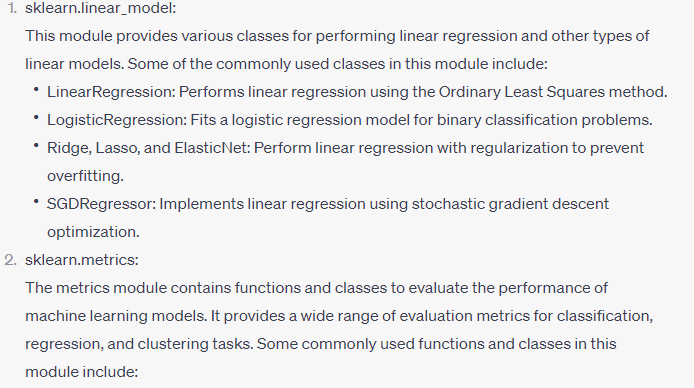


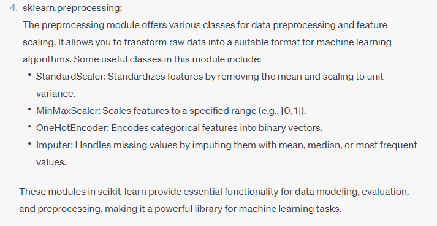

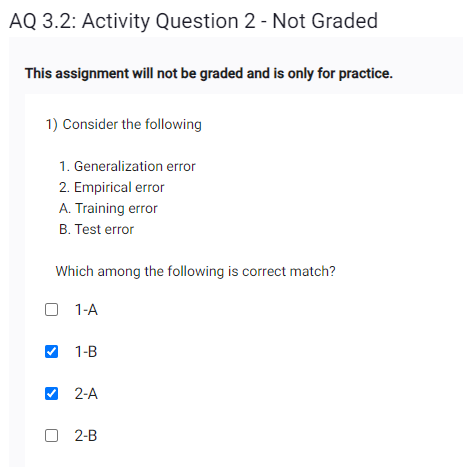

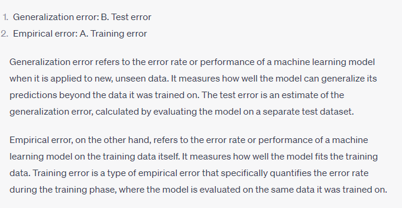
- Generalization - for test data
- Empirical - for train data

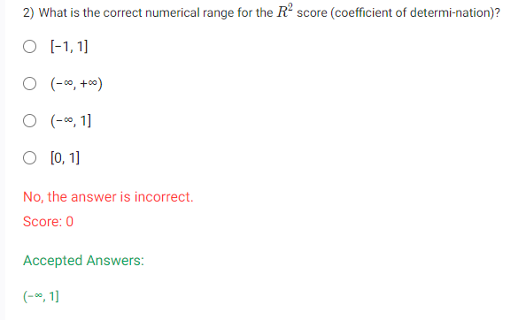

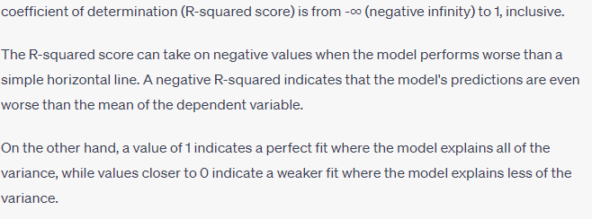

- Dont know what R2 means in simple words other than formula? - watch this --> https://youtu.be/bMccdk8EdGo  highly recommended to understand what r2 score means.

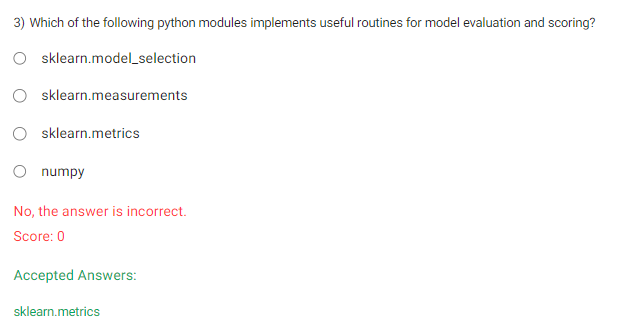
- evaluation and scoring will be from metrics like r2score,absolute mean error, etc...

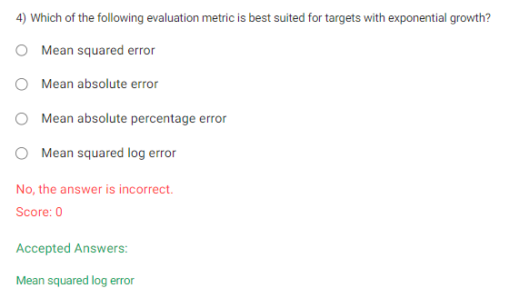

- mean squared log error , because inverse of exp is log

AQ 3.3

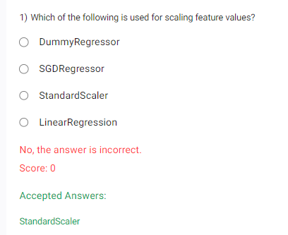
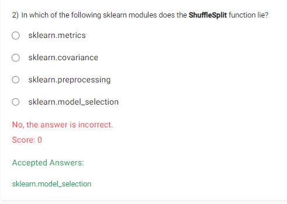
`
The ShuffleSplit function lies in the sklearn.model_selection module.`

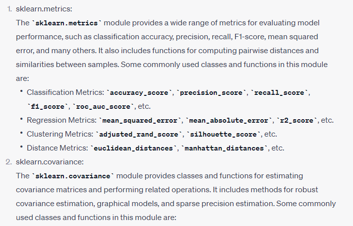
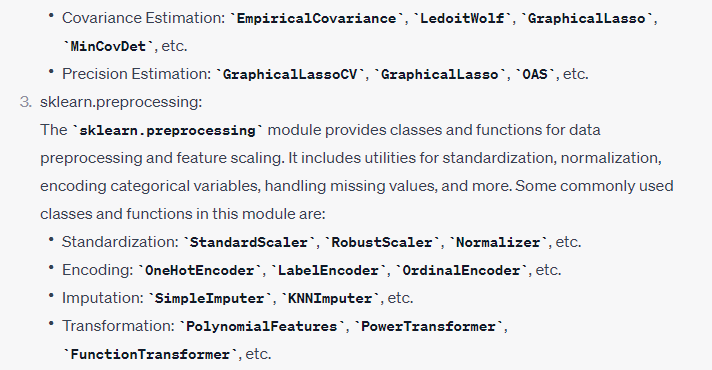
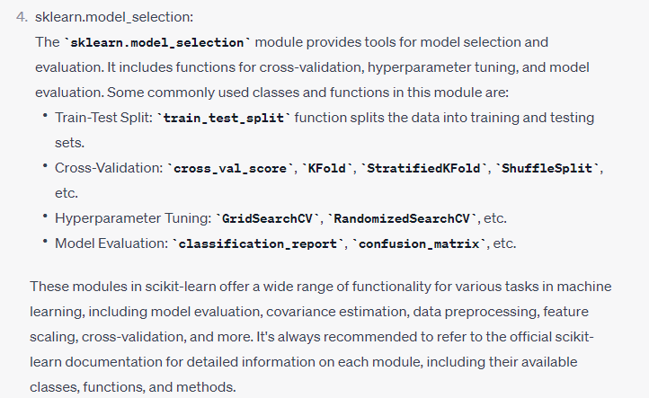

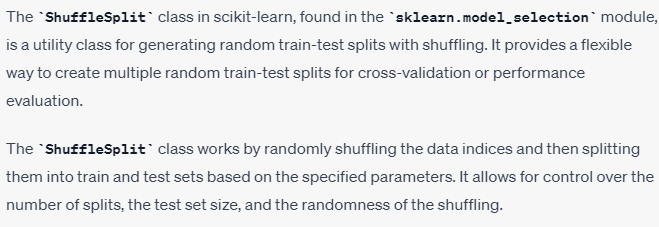

```
from sklearn.model_selection import ShuffleSplit

# Create a ShuffleSplit object
shuffle_split = ShuffleSplit(n_splits=5, test_size=0.2, random_state=42)

# Generate train-test splits
for train_index, test_index in shuffle_split.split(X):
    X_train, X_test = X[train_index], X[test_index]
    y_train, y_test = y[train_index], y[test_index]

    # Perform model fitting and evaluation on each split
    # ...

```

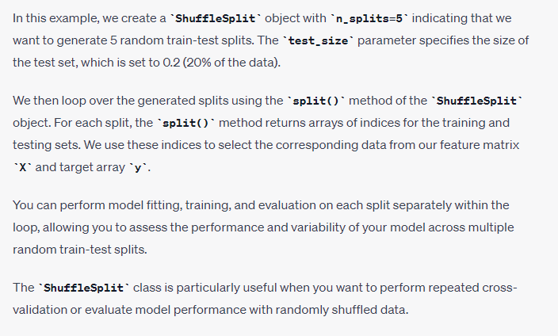
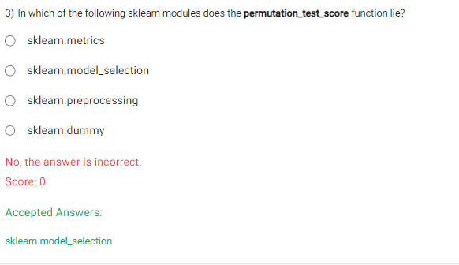

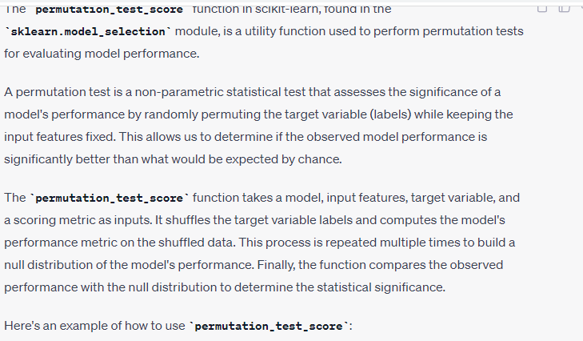
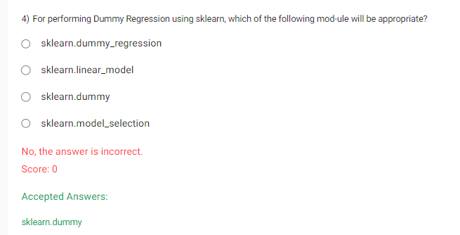