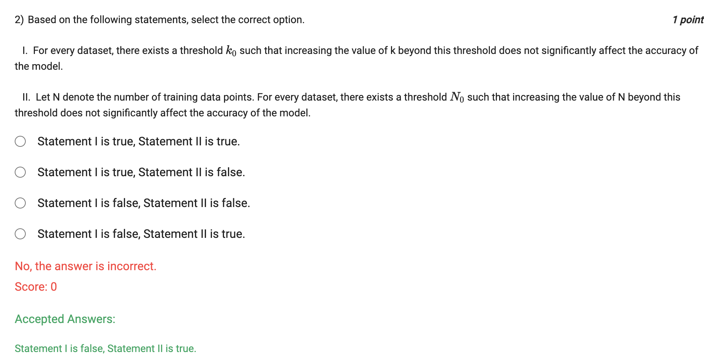
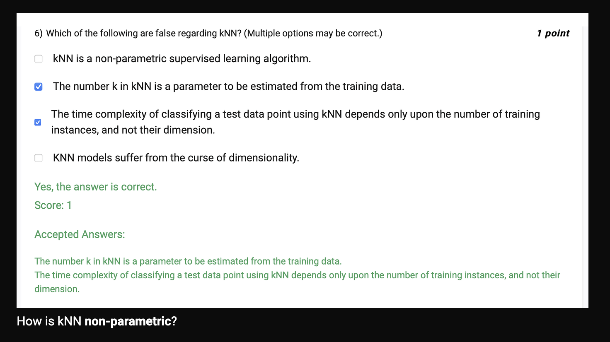
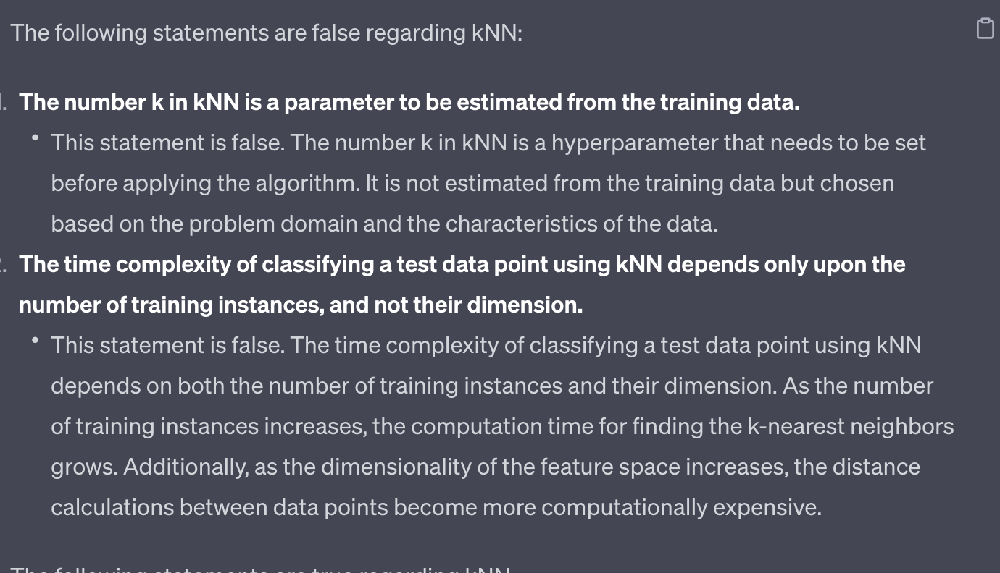
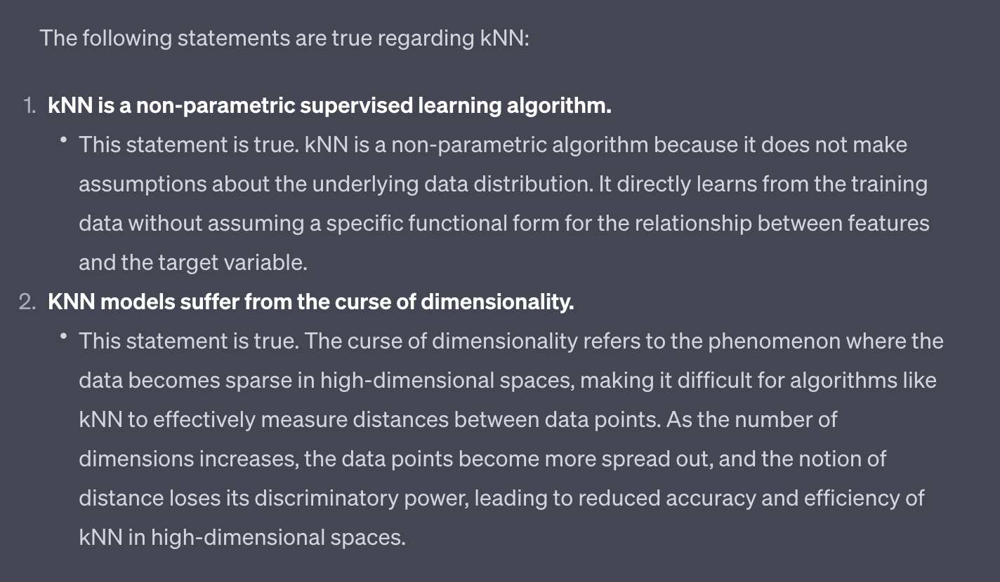

- what is softmax regression
    - softmax regression is a generalization of logistic regression to the case where we want to handle multiple classes
- what is the difference between softmax and sigmoid
    - sigmoid is used for binary classification
    - softmax is used for multi-class classification
- what is the difference between softmax and argmax
    - softmax is a function that takes as input a vector of K real numbers, and normalizes it into a probability distribution consisting of K probabilities
    - argmax is a function that outputs the index of the largest value

    - multi_class="auto" (default) will choose multinomial if the data is multilabel, otherwise it will choose ovr.
    - multi_class="multinomial" will treat each label as a binary class and fit a separate decision rule for each of them., which is supported only by the 'lbfgs', 'sag' and 'newton-cg' solvers. 
        - 'lbfgs' is an optimization algorithm in the family of quasi-Newton methods.
        - 'sag' is an optimization algorithm in the family of stochastic gradient descent methods.
        - 'newton-cg' is an optimization algorithm in the family of quasi-Newton methods.
    - multi_class="ovr" will train a binary problem for each label.
        - ovr means one-vs-rest, which is also known as one-vs-all (OvA or OvR), is a heuristic method for using binary classification algorithms for multi-class classification.

- accuracy score= TP+TN/TP+TN+FP+FN

    - confusion matrix is a table that is often used to describe the performance of a classification model (or "classifier") on a set of test data for which the true values are known
    - confusion matrix is a table with two rows and two columns that reports the number of false positives, false negatives, true positives, and true negatives
    - it is present in the sklearn.metrics module

 

