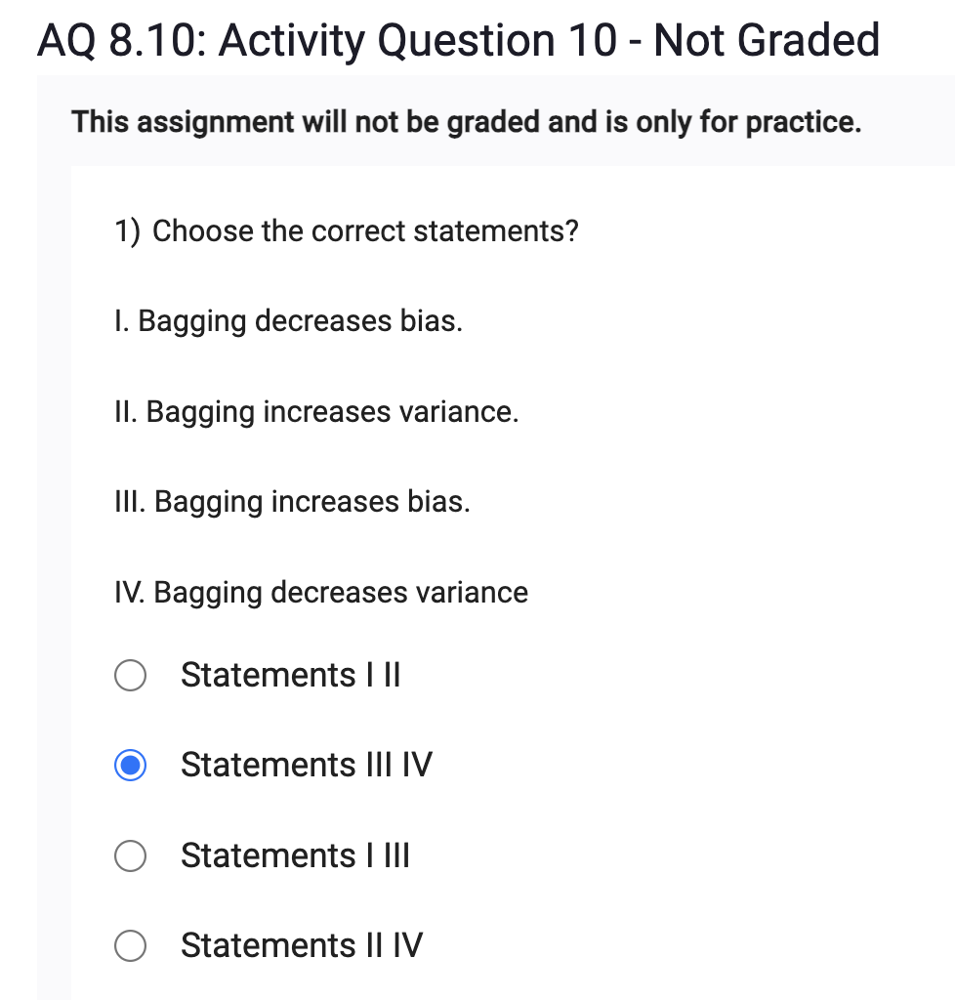
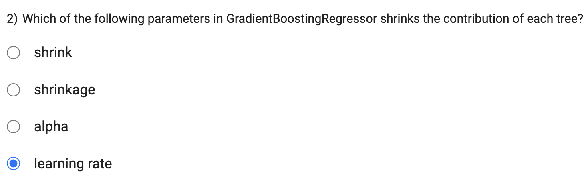
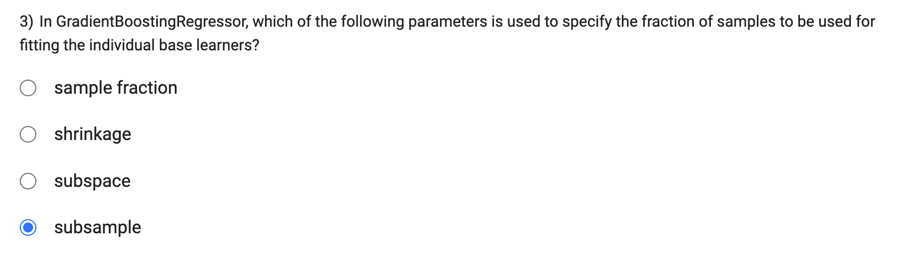

Bagging, as an ensemble technique, typically combines multiple models (learners) to form a more robust and less biased prediction. However, in some cases, Bagging can inadvertently introduce bias in the final prediction. This can happen if the individual base models have biases in the same direction, and when their predictions are averaged or combined, the resulting ensemble prediction also exhibits the same bias. Although this is less common, it is possible for Bagging to increase bias under certain circumstances.
IV. Bagging decreases variance:

One of the main benefits of Bagging is that it reduces the variance in the final prediction. By training multiple models on different subsets of the data, Bagging diversifies the individual predictions and averages them, leading to a more stable and less variable overall prediction. This variance reduction is one of the primary reasons why Bagging is effective in improving model performance and generalization.
I. Bagging decreases bias (This statement is incorrect):

While Bagging aims to reduce bias by combining multiple models, as discussed earlier, it can also introduce bias in certain scenarios, as explained in statement III.
II. Bagging increases variance (This statement is incorrect):

Bagging is designed to decrease variance by averaging or combining the predictions from multiple models. This variance reduction is a key characteristic of Bagging and helps improve the overall robustness of the model.
In summary, the correct statements are III. Bagging increases bias, and IV. Bagging decreases variance. Bagging's primary advantage lies in reducing variance, although it may sometimes introduce bias depending on the individual base models.

