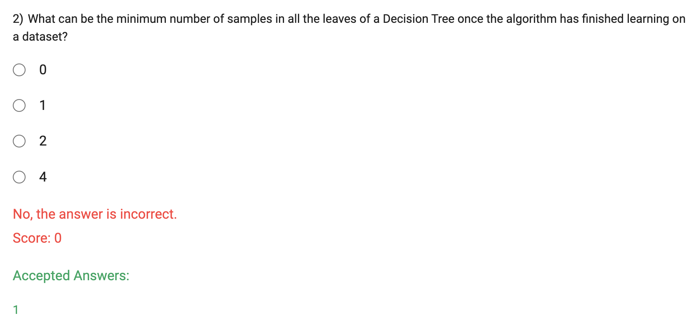

When we limit the height (depth) of a decision tree, we are essentially restricting the complexity of the model. A deeper decision tree tends to have many nodes and leaves, leading to more complex decision boundaries and potential overfitting, as the tree can become too specific to the training data.

By reducing the height of the tree, we create a simpler model that generalizes better to unseen data. A shallower tree captures more general patterns and avoids memorizing the noise in the training data. As a result, the variance of the decision tree decreases because the model becomes more stable and less sensitive to small changes in the training data.

In summary, limiting the height of the decision tree reduces the variance and helps to prevent overfitting, making the model more robust and suitable for generalization to new data.

