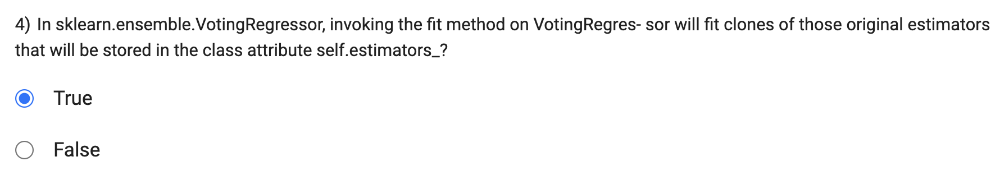

When voting is set to hard: In this mode, the voting classifier predicts the class label that receives the most votes from the individual classifiers (sub-models) in the ensemble. The class label with the majority of votes is chosen as the final prediction.

When voting is set to soft: In this mode, the voting classifier predicts the class label based on the weighted average (sum) of the predicted probabilities from the individual classifiers. The class label with the highest probability (argmax) after summing is chosen as the final prediction.

Random Forests differ from simple bagging in that they introduce an additional randomness in the tree-building process. In Random Forests, during the construction of each tree, only a random subset of features (variables) is considered at each split, rather than considering all available features. This process is known as "feature bagging" or "feature subsampling."

The idea behind this feature subsampling is to reduce the correlation between the trees in the ensemble. By using different subsets of features for each tree, Random Forests encourage greater diversity among the trees and make the ensemble more robust and accurate.

In contrast, in simple bagging (such as Bagged Decision Trees), all features are considered at each split, and each tree is built independently using the same data, potentially leading to correlated trees.

Therefore, the statement "Random Forests differ from bagging by forcing the tree to use a subset of its available features while constructing each tree" is true.