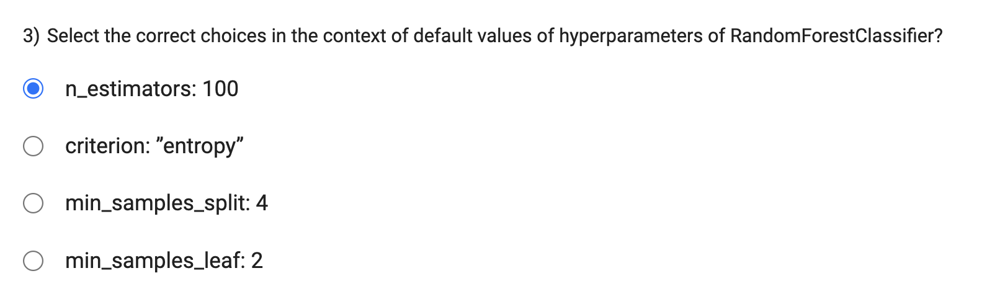

The oob_score parameter in scikit-learn's RandomForestClassifier and RandomForestRegressor is used to enable out-of-bag (OOB) scoring. When set to True, the model will use the out-of-bag samples (samples that were not included in the bootstrap sample of a particular tree) to estimate the generalization performance of the ensemble.

However, the oob_score option is only available when bootstrap is set to True. In other words, you cannot enable out-of-bag scoring (oob_score=True) if you are not using bootstrap sampling (bootstrap=False) to create random subsets of the data for each tree.

- n_estimators: 100 

    - The n_estimators parameter specifies the number of trees in the random forest ensemble. The default value is 100.
- criterion: "gini" 

    - The criterion parameter determines the function used to measure the quality of a split. The default value is "gini," which stands for Gini impurity. While "entropy" is another option for the criterion parameter, the default is "gini."
- min_samples_split: 2 
    - The min_samples_split parameter specifies the minimum number of samples required to split an internal node. The default value is 2, not 4.
- min_samples_leaf: 1 

    - The min_samples_leaf parameter specifies the minimum number of samples required to be at a leaf node. The default value is 1, not 2.