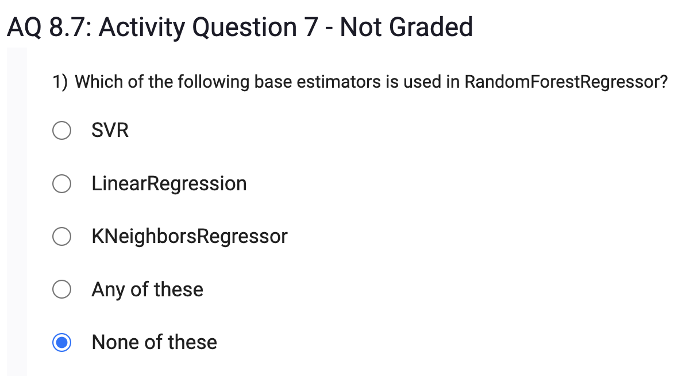
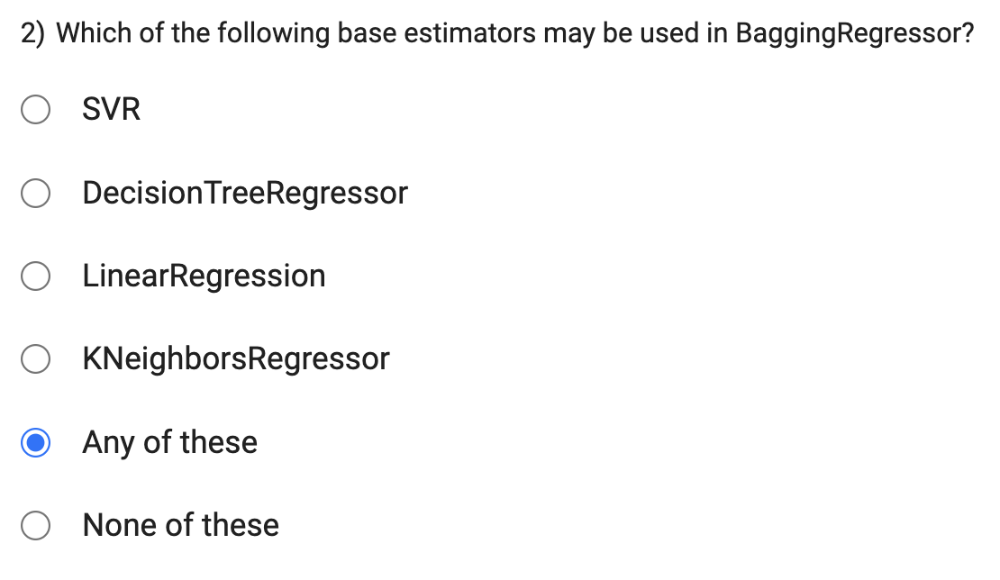
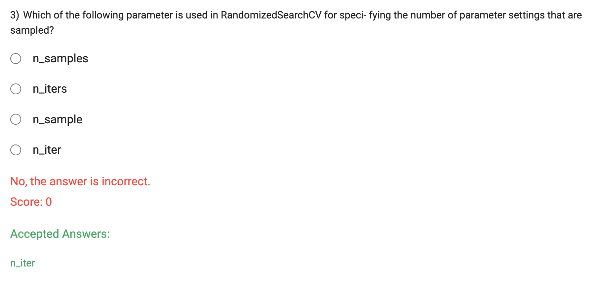
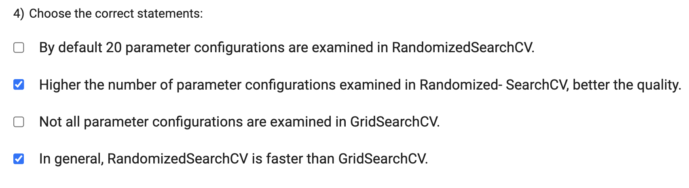

By default, RandomizedSearchCV does not examine a fixed number of 20 parameter configurations. Instead, it samples a specified number of parameter settings from the given search space. The number of parameter configurations examined depends on the n_iter parameter, which determines how many random combinations of hyperparameters are sampled during the search.

Not all parameter configurations are examined in GridSearchCV. GridSearchCV performs an exhaustive search over all possible combinations of hyperparameter values provided in the search space. If the search space is large or contains a high number of hyperparameters, the exhaustive search can become computationally expensive.

In general, RandomizedSearchCV is faster than GridSearchCV. This is because RandomizedSearchCV samples a fixed number of random parameter configurations, which can be more efficient when the search space is large. On the other hand, GridSearchCV performs an exhaustive search over all possible combinations, which can be time-consuming and impractical for larger search spaces.