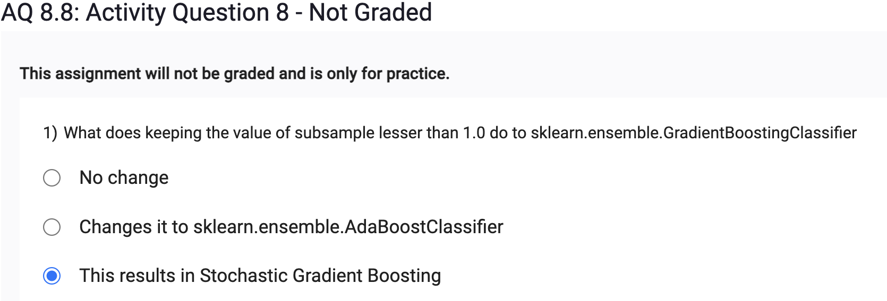
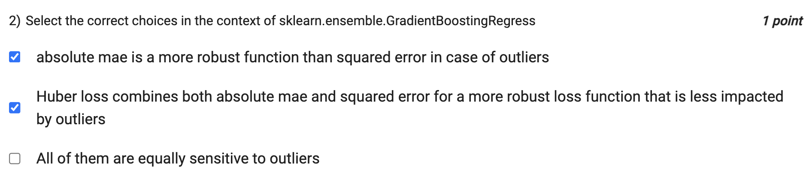
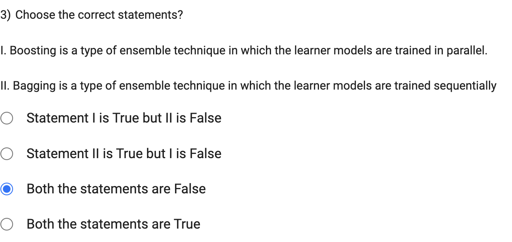
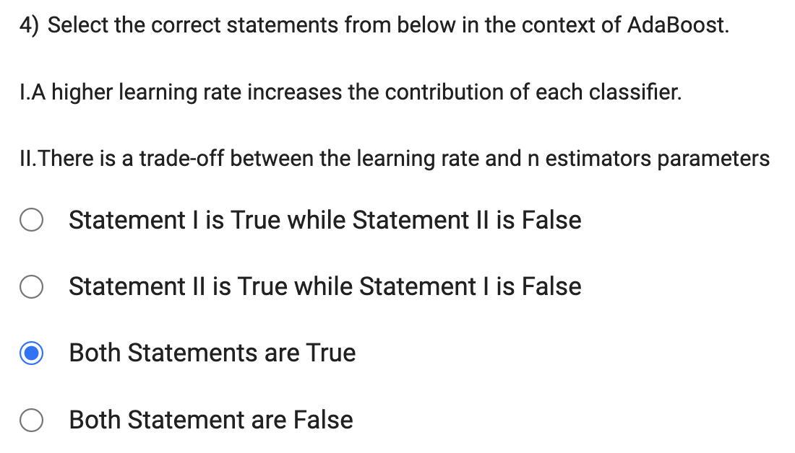

The subsample parameter in GradientBoostingClassifier determines the fraction of samples to be used for fitting the individual base learners (decision trees). By default, subsample is set to 1.0, which means all the samples are used for fitting each tree.

However, if you set subsample to a value less than 1.0 (0.0 < subsample < 1.0), it means that only a random subset of the training data will be used to train each tree. This is known as Stochastic Gradient Boosting or Stochastic Gradient Boosting Machine (SGBM).

In Stochastic Gradient Boosting, the algorithm randomly samples a fraction of the training data without replacement for each tree. This introduces randomness and variance in the model and can help improve generalization and reduce overfitting, especially in cases where the dataset is large.

Setting subsample to a value less than 1.0 can be useful when you have a large dataset and you want to introduce some level of randomness in the ensemble to prevent overfitting and improve model performance on unseen data.

absolute mae is a more robust function than squared error in case of outliers:

Mean Absolute Error (MAE) is less sensitive to outliers compared to Mean Squared Error (MSE) because it treats the differences between actual and predicted values linearly. Outliers have a smaller impact on the overall loss in MAE compared to MSE, where the differences are squared, leading to larger penalties for outliers.
Huber loss combines both absolute mae and squared error for a more robust loss function that is less impacted by outliers:

Huber loss is a hybrid loss function that combines the advantages of both MAE and MSE. It behaves like MAE for small errors (less sensitive to outliers) and like MSE for larger errors. The transition from MAE to MSE is controlled by a parameter (delta) that determines the point where the loss function switches from absolute to squared error. Huber loss provides a balance between robustness to outliers and convergence properties, making it less sensitive to outliers than MSE but still more stable than MAE.
All of them are equally sensitive to outliers (This choice is incorrect):

This statement is not correct. As explained in points 1 and 2, both absolute MAE and Huber loss are designed to be less sensitive to outliers compared to squared error (MSE). Therefore, they are not equally sensitive to outliers.   

I. Boosting: Boosting is an ensemble technique in which the learner models are trained sequentially. It works by iteratively training weak learners (e.g., decision trees with limited depth) in a step-wise manner. Each subsequent weak learner focuses on the mistakes made by the previous learners and gives more weight to the misclassified samples, trying to correct them. Popular boosting algorithms include AdaBoost, Gradient Boosting (e.g., GradientBoostingClassifier and GradientBoostingRegressor in scikit-learn), and XGBoost.

II. Bagging: Bagging, short for Bootstrap Aggregating, is an ensemble technique in which the learner models are trained in parallel. It involves creating multiple subsets of the training data by random sampling with replacement (bootstrapping) and training a separate learner model on each subset. The final prediction is obtained by averaging (for regression) or voting (for classification) the predictions of individual models. Random Forest is a popular ensemble algorithm based on bagging.

I. A higher learning rate increases the contribution of each classifier:

In AdaBoost, the learning rate (also known as the step size or shrinkage) is a hyperparameter that determines the contribution of each weak learner (classifier) to the final ensemble. A higher learning rate gives more weight to the predictions of each weak learner, leading to a stronger influence on the final prediction. However, it can also make the algorithm more susceptible to overfitting.
II. There is a trade-off between the learning rate and n_estimators parameters:

In AdaBoost, the n_estimators parameter specifies the number of weak learners (classifiers) to be combined in the ensemble. A larger value of n_estimators usually results in a more complex model with higher performance. However, using a high learning rate in combination with a large n_estimators value can increase the risk of overfitting. A lower learning rate and a higher number of estimators can strike a balance between performance and overfitting.
In summary, both statements are correct. A higher learning rate increases the contribution of each classifier in AdaBoost, and there is a trade-off between the learning rate and n_estimators parameters in determining the overall performance and generalization ability of the AdaBoost ensemble.

