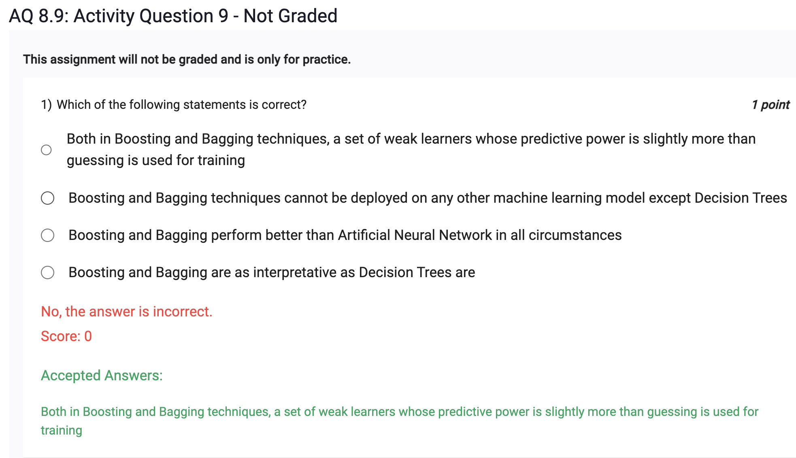
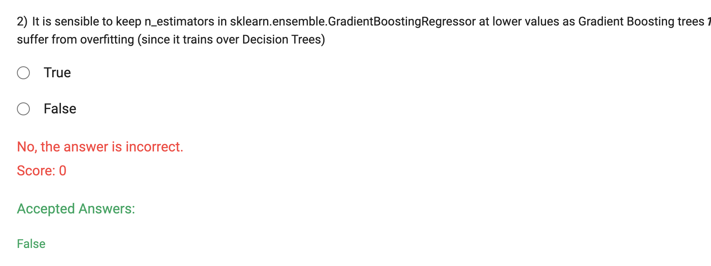
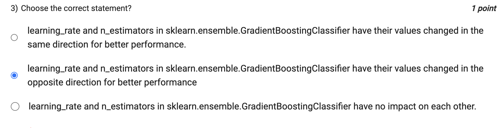

Both in Boosting and Bagging techniques, a set of weak learners whose predictive power is slightly more than guessing is used for training:

This statement is correct. Both Boosting and Bagging are ensemble techniques that use multiple weak learners (classifiers or regressors) in combination to create a strong learner. A weak learner is a model whose predictive accuracy is just slightly better than random guessing. The idea is to combine the predictions of multiple weak learners to build a more accurate and robust model.
Boosting and Bagging techniques cannot be deployed on any other machine learning model except Decision Trees:

This statement is incorrect. While Decision Trees are commonly used as base learners in Boosting and Bagging, these ensemble techniques are not limited to Decision Trees. They can be applied to other machine learning models as well, such as support vector machines, linear regression, neural networks, etc.
Boosting and Bagging perform better than Artificial Neural Network in all circumstances:

This statement is incorrect. The performance of Boosting and Bagging, as well as Artificial Neural Networks, depends on the specific problem, dataset, and other factors. There is no single algorithm that always performs better in all circumstances. The performance comparison between different techniques requires empirical evaluation on the specific task at hand.
Boosting and Bagging are as interpretative as Decision Trees are:

This statement is incorrect. Decision Trees are considered more interpretable than Boosting and Bagging because the decision process in a Decision Tree is represented as a tree structure with clear rules at each node. In contrast, ensemble techniques like Boosting and Bagging combine multiple models, making their decision-making process more complex and less interpretable. Interpretability is one of the trade-offs when choosing between different machine learning algorithms.

In Gradient Boosting, the n_estimators parameter determines the number of boosting stages, i.e., the number of weak learners (typically decision trees) to be combined in the ensemble. Each weak learner tries to correct the errors made by the previous ones, leading to a stronger predictive model. However, increasing the number of boosting stages (n_estimators) can make the model more complex and prone to overfitting, especially when the number of trees is large.

When using Gradient Boosting, overfitting is a concern, particularly if the number of trees is set too high for the complexity of the data. Overfitting occurs when the model captures noise and random fluctuations in the training data, resulting in poor generalization to unseen data.

To avoid overfitting in Gradient Boosting, it is sensible to keep the value of n_estimators at lower values. A smaller number of boosting stages can lead to simpler models, reducing the risk of overfitting and improving the model's generalization performance.

It is important to find an optimal value for n_estimators through techniques like cross-validation to strike a balance between model complexity and generalization ability. The ideal number of boosting stages can vary depending on the dataset's size, complexity, and the presence of noise or outliers.

In sklearn.ensemble.GradientBoostingClassifier, the learning_rate and n_estimators parameters are both important hyperparameters that influence the performance of the Gradient Boosting ensemble.

learning_rate: The learning_rate parameter controls the contribution of each tree (weak learner) in the ensemble. It scales the impact of each tree's prediction on the final ensemble prediction. A smaller learning rate shrinks the contribution of each tree, while a larger learning rate increases it. Smaller learning rates require more trees to reach the same training performance, leading to a more conservative boosting process.

n_estimators: The n_estimators parameter specifies the number of boosting stages (trees) to be combined in the ensemble. A larger n_estimators value increases the complexity of the model as more trees are added to the ensemble. This can lead to better performance on the training data but may also increase the risk of overfitting.

When tuning these hyperparameters for better performance, they are generally changed in the opposite direction:

Lowering the learning_rate and increasing n_estimators: This combination can improve the model's generalization ability by preventing overfitting and building a more robust ensemble. A smaller learning rate reduces the impact of each tree's prediction, and a larger number of estimators provides more opportunities to improve the overall ensemble performance.

Increasing the learning_rate and reducing n_estimators: This combination can lead to faster convergence during training but may risk overfitting, as the boosting process will have more aggressive updates at each step.

In summary, learning_rate and n_estimators in sklearn.ensemble.GradientBoostingClassifier are changed in the opposite direction for better performance, and finding the right balance between them is crucial for achieving a well-performing and well-generalized model.