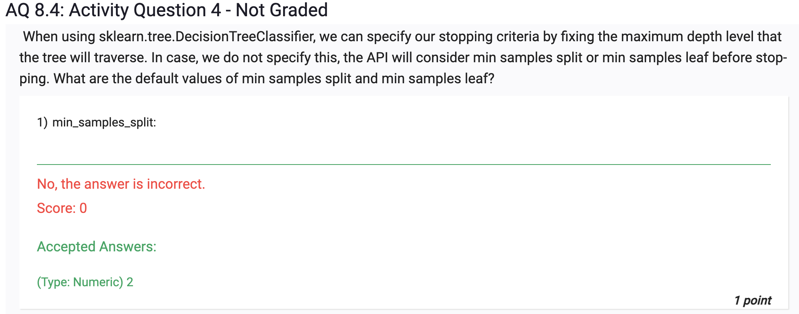

- Not necessarily

While it is true that Decision Trees are not impacted by different scales of features (as mentioned earlier), they can still be sensitive to small variations in the data, especially if the tree is allowed to grow deep (large depth). Decision Trees can potentially memorize noise in the training data if they are too deep and complex, leading to overfitting.

Decision Trees tend to be sensitive to outliers and small fluctuations in the data. In a deep tree, a single outlier or noisy data point could lead to the creation of many new branches, which might not generalize well to new data.

To prevent Decision Trees from overfitting and being sensitive to small variations in the data, it is common to use techniques such as:

Limiting the depth of the tree (controlling model complexity).
Pruning the tree to remove branches that do not contribute significantly to improving performance on the validation set.
Ensuring a minimum number of samples per leaf or node to avoid creating small, noisy leaves.
By employing these techniques, you can make Decision Trees more robust to small variations in the data and improve their generalization performance on unseen data.