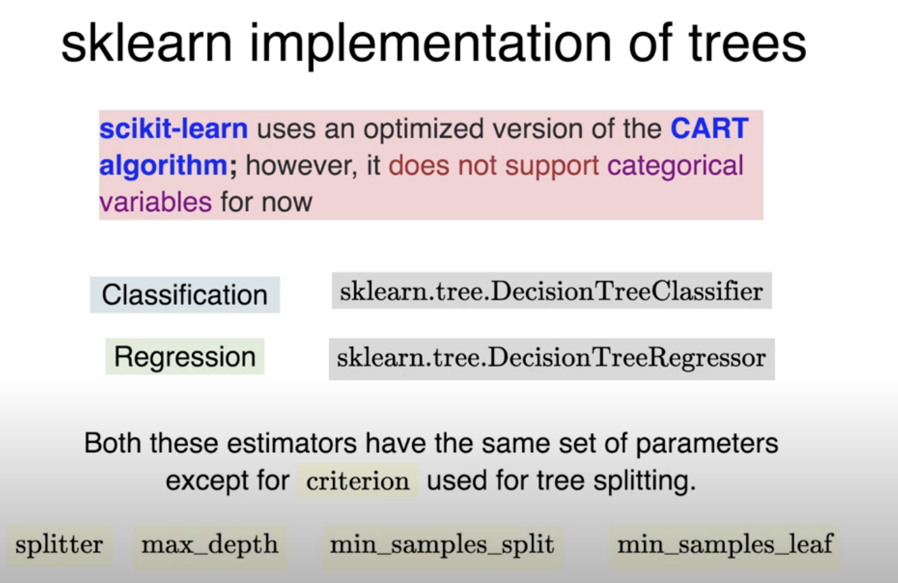

# Decision Trees

- What is a decision tree?
    - A decision tree is a tree where each node represents a feature(attribute), each link(branch) represents a decision(rule) and each leaf represents an outcome(categorical or continues value).
    - The whole idea is to create a tree like this for the entire data and process a single outcome at every leaf(or minimize the error in case of continues values).
    - They are non parametric models, which means that they do not make any assumptions on the underlying data distribution.
    - They are also white box models, which means that the output of the model can be interpreted easily by looking at the decision path of the tree.
    - Can learn Classification as well as Regression trees.
    - Predict labels based on the features of the data.
    
    - WHat is rule sets?
        - A rule set is a set of rules that can be used to classify a data point.
        - A rule is a boolean expression of the form:
            - if condition then outcome
    - 
    