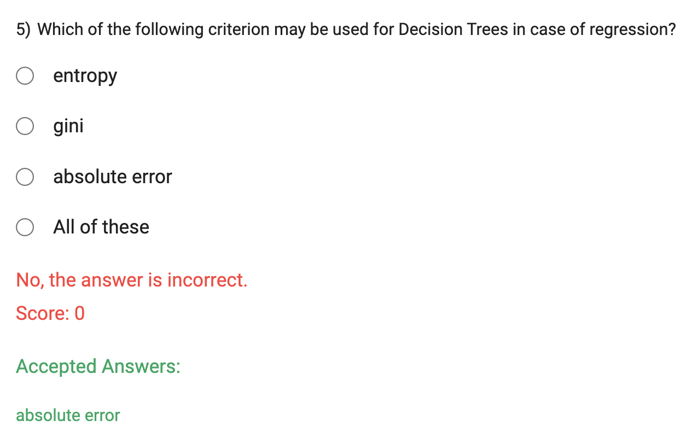
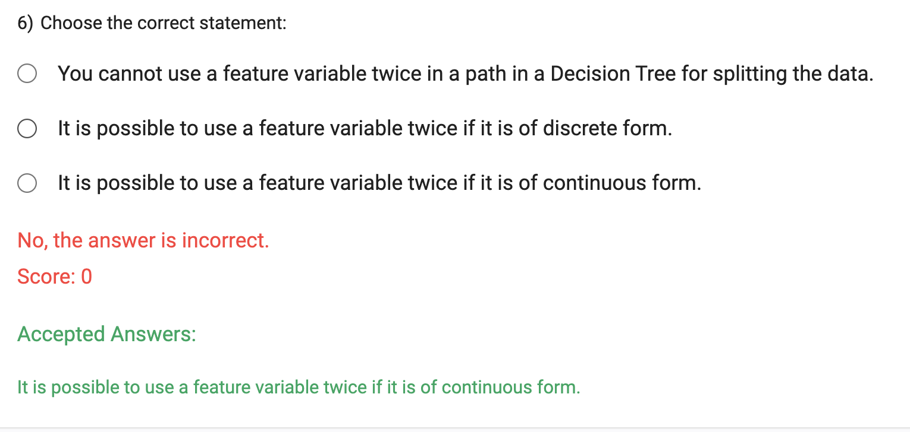
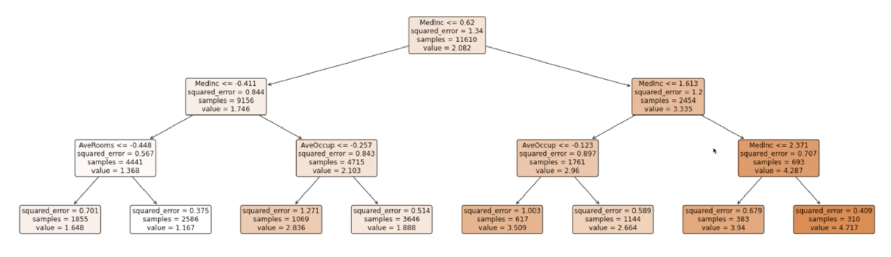
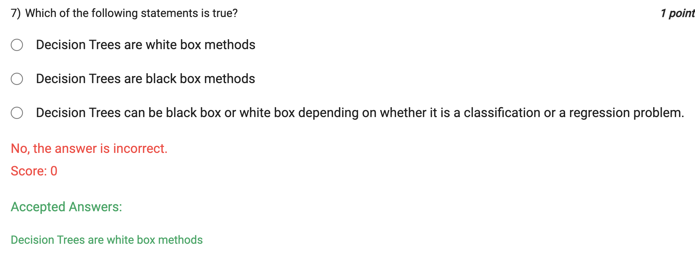
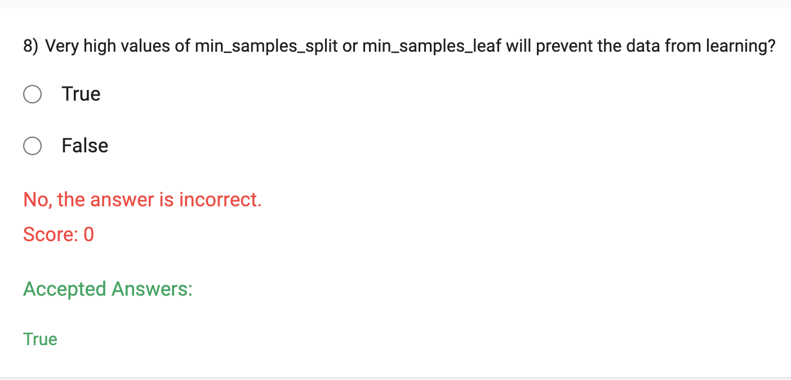

-  Decision Trees are actually non-parametric `supervised` learning methods used for classification and regression tasks. 

- What is gini impurity for binary classification?
    - Gini impurity is a measure of how often a randomly chosen element from the set would be incorrectly labeled if it was randomly labeled according to the distribution of labels in the subset.
    - It is calculated by subtracting the sum of the squared probabilities of each class from one.
    - It favors larger partitions and easy to implement.
    - It is used in the CART (Classification and Regression Tree) algorithm for classification trees, which is the algorithm that we are using for our decision trees.
    - It works with categorical target variable “Success” or “Failure”.

a) This statement is generally not true for decision trees. Decision trees have the potential to be highly flexible and can fit complex patterns in the data. They are known for having a tendency to overfit the training data, which can lead to low bias and high variance. However, various techniques like pruning and limiting tree depth can be used to control overfitting and reduce variance.

- overfitting leads to high variance and low bias and so will the decision tree.
    - variance is the amount that the estimate of the target function will change if different training data was used
    - bias is the error that is introduced by approximating a real-life problem, which may be extremely complicated, by a much simpler model.
    - The bias-variance tradeoff is a central problem in supervised learning. Ideally, one wants to choose a model that both accurately captures the regularities in its training data, but also generalizes well to unseen data. Unfortunately, it is typically impossible to do both simultaneously. High-variance learning methods may be able to represent their training set well, but are at risk of overfitting to noisy or unrepresentative training data. In contrast, algorithms with high bias typically produce simpler models that don't tend to overfit, but may underfit their training data, failing to capture important regularities.

C) Not necessarily.

`min_samples_split`: This parameter determines the minimum number of samples required to split an internal node further. Increasing this value can help prevent the tree from creating additional splits for small subsets of data, reducing the likelihood of overfitting.

`max_depth`: This parameter controls the maximum depth of the decision tree. Limiting the depth of the tree can prevent it from becoming too complex and overfitting the training data.

`min_samples_leaf`: This parameter sets the minimum number of samples required to be in a leaf node. Increasing this value can prevent the tree from creating leaves with very few samples, which can help in reducing overfitting.

`The criterion parameter` (e.g., "gini" or "entropy") determines the function used to measure the quality of a split. Changing the criterion does not directly control overfitting but may influence the decision tree's behavior in terms of feature selection and tree growth. The primary parameters to focus on for handling overfitting are min_samples_split, max_depth, and min_samples_leaf.

In a Decision Tree, if a feature is of continuous form (numeric), it is possible to use the same feature variable more than once along different paths in the tree. This is because continuous features can have multiple possible split points, allowing the tree to create different branches with different split thresholds.

For example, if a Decision Tree splits the data based on Feature A > 5 at one node and later splits again based on Feature A > 10 at a different node, it is using the same continuous feature (Feature A) twice in different contexts.

On the other hand, if a feature is of discrete form (categorical), it cannot be used more than once along the same path in the tree. Once a categorical feature is used for splitting, it is no longer available for further splits along that path.

So, to clarify:

For continuous features, it is possible to use the feature variable more than once in a Decision Tree, as long as it creates different split points at different nodes.
For discrete features, a feature variable can only be used once along a particular path in the tree.

    - White box models are models that are interpretable by humans. They are also known as glass box models. Decision trees are white box models because they can be visualized and interpreted by humans. In contrast, black box models are models that are not interpretable by humans. Neural networks are an example of black box models because they are very difficult to visualize and interpret.
    - Black box models are models that are not interpretable by humans. They are also known as glass box models. Decision trees are white box models because they can be visualized and interpreted by humans. In contrast, black box models are models that are not interpretable by humans. Neural networks are an example of black box models because they are very difficult to visualize and interpret.

- Why do we use `negative mean squared error ` as scoring parameter?
    - The scoring parameter is used to measure the performance of the model. For regression models, the scoring parameter is usually set to mean squared error (MSE). The MSE is calculated by taking the average of the squared errors between the predicted and actual values. The squared error is calculated by subtracting the actual value from the predicted value and squaring the result. The MSE is a measure of how close a fitted line is to data points. A lower MSE indicates a better fit.
    