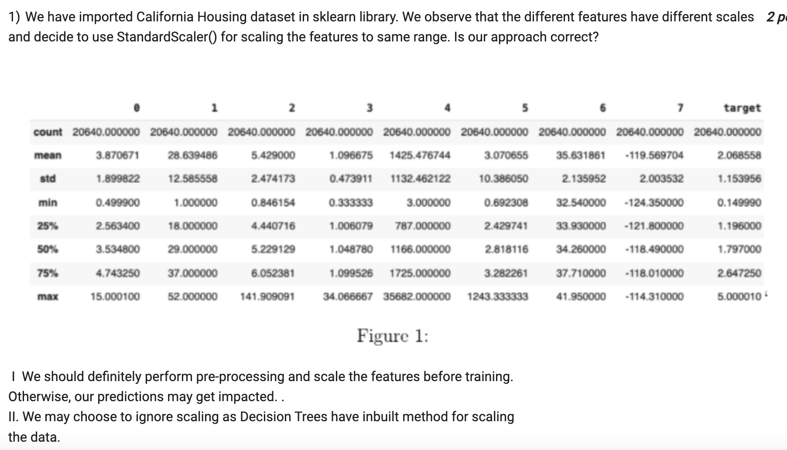
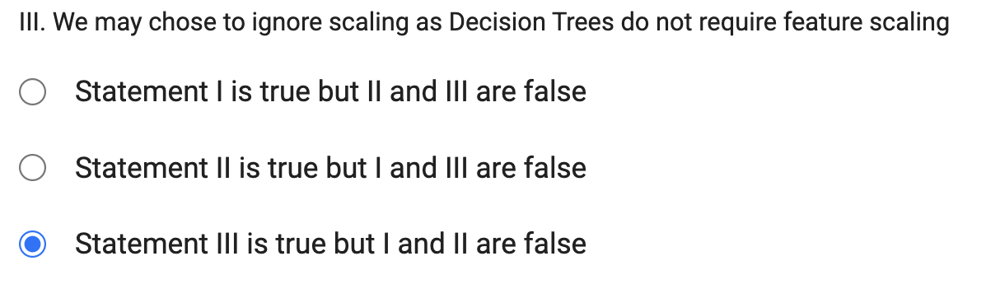
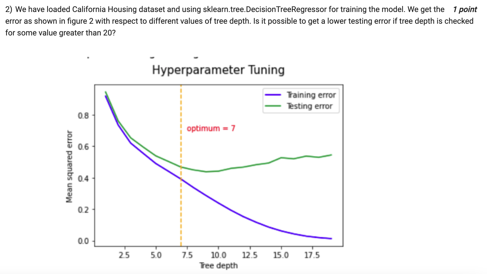
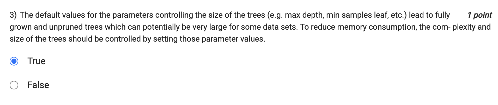
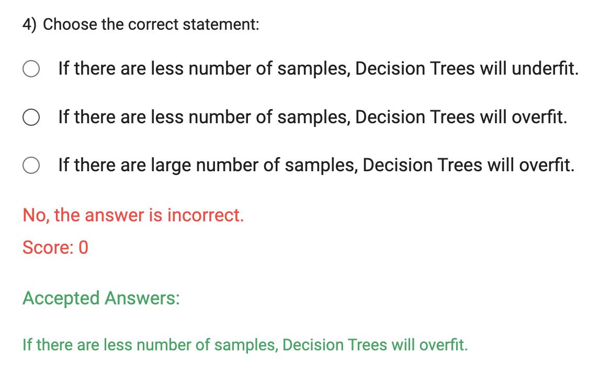

Decision Trees are non-parametric models that make binary splits based on feature thresholds. They are not sensitive to the scale of the features, as the splitting process is based on the relative ordering of feature values, not their actual magnitudes. Whether a feature is on a small scale or a large scale, it will not affect the decisions made by the Decision Tree.

Therefore, feature scaling is not necessary when using Decision Trees, and you can choose to ignore scaling for this particular algorithm.

- NO

 