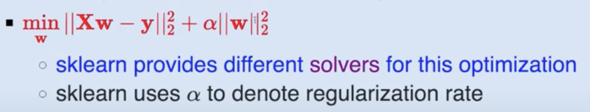

In this week we will learn about the following topics for classification algorithms:

- [ ] Logistic Regression
- [ ] least squares classification
-  [ ] perceptron
    - with regularization,
    - multiclass,multi-label classification,multi-output settings
- classification metrics

- Cross validation and hyperparameter search for classification works exactly the same as for regression. 
    - however there are a couple of cv strategies that are specific to classification.

# Part 1 : sklearn API's for classification

- there are broadly two types of API's based on their functionality
    - Generic
        - SGDClassifier
            - uses stochastic gradient descent for optimization
            - need to specify the loss function
    - Specific
        - LogisticRegression
        - Perceptron
        - RidgeClassifier
        - KNN
        - SVM
        - Naive Bayes
            - Uses specific algorithms for optimization(solvers)
- all sklearn estimators for classification implement a few common methods for 
    - model training
        - `fit(X,y[,coef_init,intercept_init, …])`
    - model prediction  
        - `predict(X)` predict class labels for samples in X.
        - `decision_function(X)`  Predict confidence scores for samples.
    - model evaluation
        - `score(X,y[,sample_weight])` Returns the mean accuracy on the given test data and labels.
        - miscellanous methods
            - `get_params([deep])` Get parameters for this estimator.
            - `set_params(**params)` Set the parameters of this estimator.
            - `densify()` Convert coefficient matrix to dense array format.
            - `sparsify([threshold])` Convert coefficient matrix to sparse format.

# How to implement different classifiers with sklearn API's

- Ridge Classifier
    - its a classifier variant of Ridge Regressor
    - can be used in 
        - binary
            - classifier converts the labels to {-1,1} internally and then uses the same loss function as Ridge Regressor
            - optimizing the same objective function as the Ridge Regressor
            - minimizes a penalized residual sum of squares
            - 
            - predicted class corresponds to the sign of the regression's prediction
            - i.e if regression predicts a positive value then the class is 1 else -1
        - multiclass classification
    - `sklearn.linear_model.RidgeClassifier`
    - `sklearn.linear_model.RidgeClassifierCV`