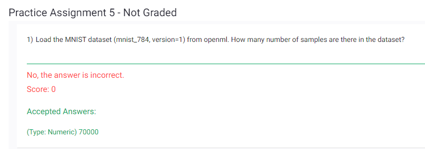
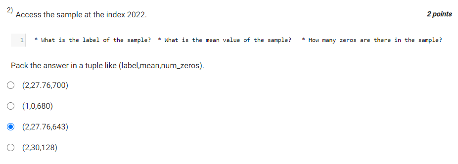
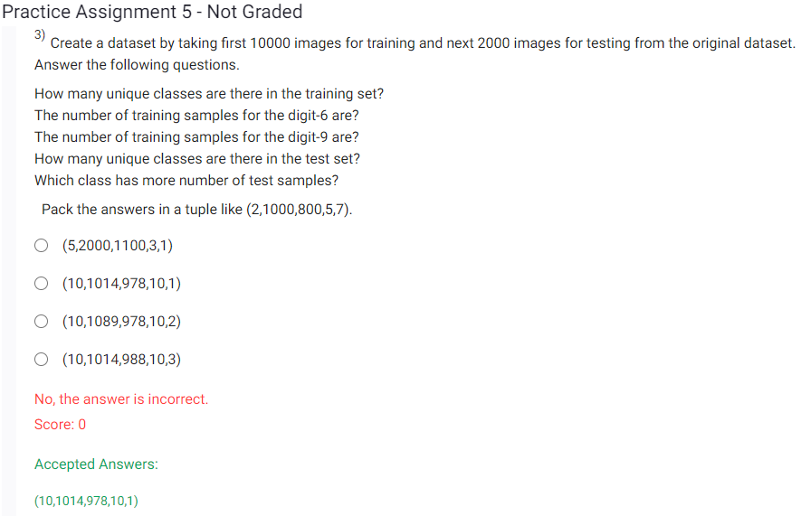
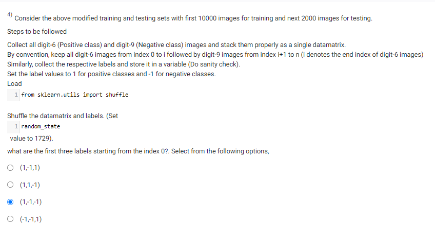
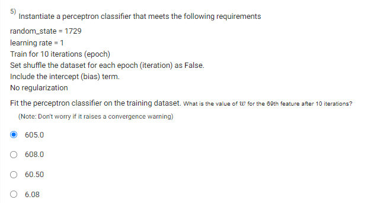
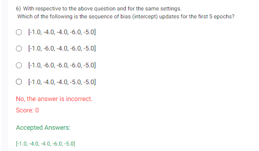

```
from sklearn.datasets import fetch_openml

# Load the MNIST dataset
mnist = fetch_openml(name='mnist_784', version=1)

# Get the number of samples in the dataset
num_samples = len(mnist.data)

print("Number of samples in the MNIST dataset:", num_samples)

```


```
import numpy as np
index = 2022
sample = mnist.data[index:index+1]
# Get the label of the sample
label = mnist.target[index]

# Get the mean value of the sample
mean_axis0 = np.mean(sample.values[0], axis=0)

# Count the number of zeros in the sample
num_zeros = (sample == 0).sum()

# Create a tuple with the requested information
# result = (label, mean, num_zeros.sum())

print("Sample at index 2022:", label,mean_axis0,num_zeros.sum())

```

```
# Set the number of training and testing samples
num_train_samples = 10000
num_test_samples = 20000

# Split the dataset into training and testing subsets
X_train = mnist.data[:num_train_samples]
y_train = mnist.target[:num_train_samples]
X_test = mnist.data[num_train_samples:num_train_samples+num_test_samples]
y_test = mnist.target[num_train_samples:num_train_samples+num_test_samples]

# Get the unique classes in the training set
unique_classes_train = len(np.unique(y_train))

# Count the number of training samples for digit 6 and digit 9
num_train_digit_6 = np.sum(y_train == '6')
num_train_digit_9 = np.sum(y_train == '9')

# Get the unique classes in the test set
unique_classes_test = len(np.unique(y_test))

# Count the number of test samples for each class and find the class with the maximum count
test_sample_counts = np.bincount(y_test.astype(int))
class_with_max_test_samples = np.argmax(test_sample_counts)

# Create a tuple with the answers
answers = (unique_classes_train, num_train_digit_6, num_train_digit_9, unique_classes_test, class_with_max_test_samples)

print("Answers:", answers)

```

```
import numpy as np
from sklearn.utils import shuffle

# Collect all digit-6 (Positive class) and digit-9 (Negative class) images and stack them properly
positive_class_images = mnist.data[:10000][y_train[:10000] == '6']
negative_class_images = mnist.data[:10000][y_train[:10000] == '9']
data_matrix = np.vstack((positive_class_images, negative_class_images))

# Collect the respective labels and store them in a variable
positive_class_labels = np.ones(positive_class_images.shape[0])
negative_class_labels = -np.ones(negative_class_images.shape[0])
labels = np.concatenate((positive_class_labels, negative_class_labels))

# Shuffle the data matrix and labels
data_matrix, labels = shuffle(data_matrix, labels, random_state=1729)

# Get the first three labels starting from index 0
first_three_labels = labels[:3]

print("First three labels starting from index 0:", first_three_labels)
```



```
from sklearn.linear_model import Perceptron

random_state = 1729
learning_rate = 1
n_iterations = 10
shuffle = False

# Instantiate the perceptron classifier
perceptron = Perceptron(random_state=random_state, eta0=learning_rate, max_iter=n_iterations, shuffle=shuffle)

# Fit the perceptron classifier on the training dataset
perceptron.fit(data_matrix, labels)  # Replace data_matrix and labels with your actual training data

# Get the coefficients (weights) of the perceptron
weights = perceptron.coef_

# Get the value of w for the 69th feature
w_69 = weights[0][69]  # Assuming the features are 1-indexed, change the index if needed

print("Value of w for the 69th feature after 10 iterations:", w_69)
```

